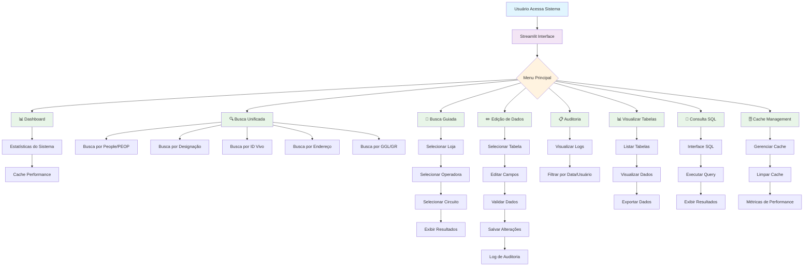
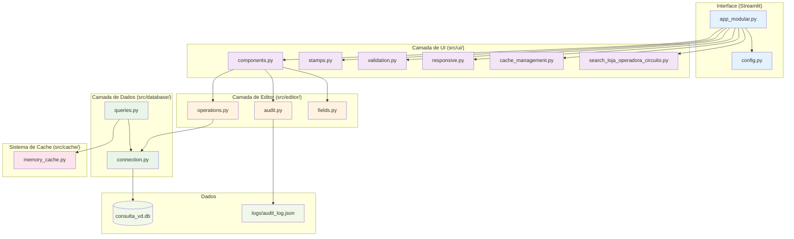
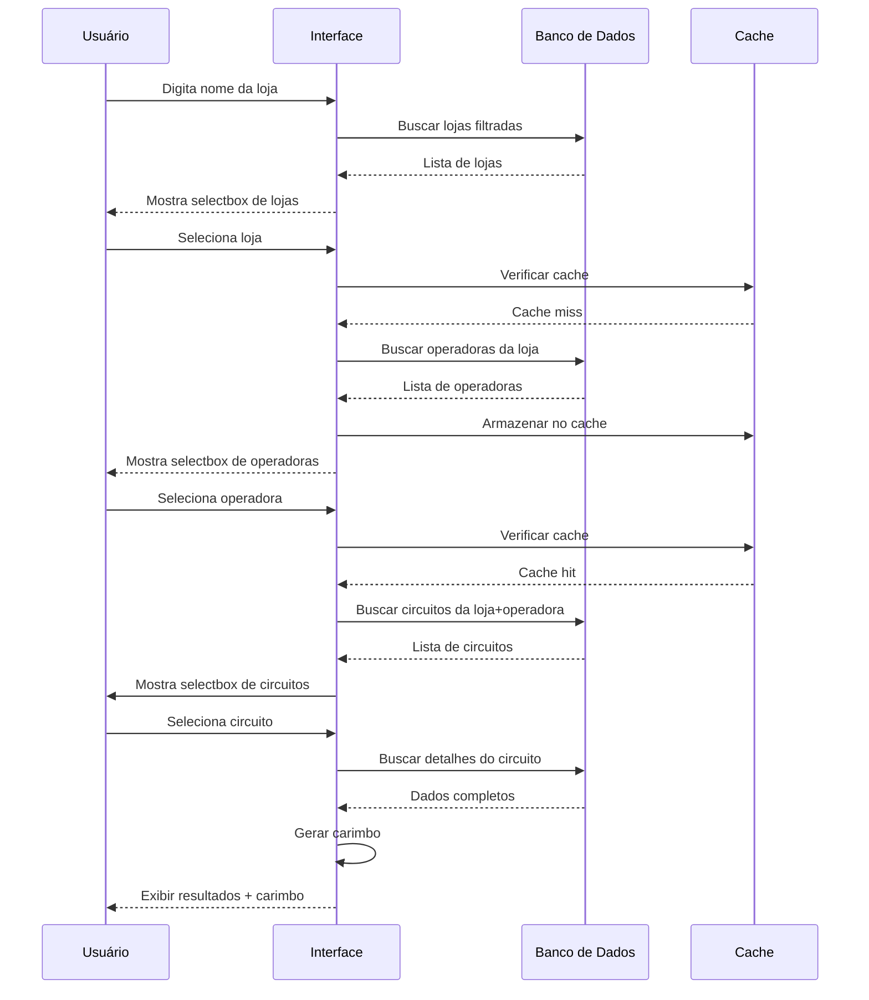
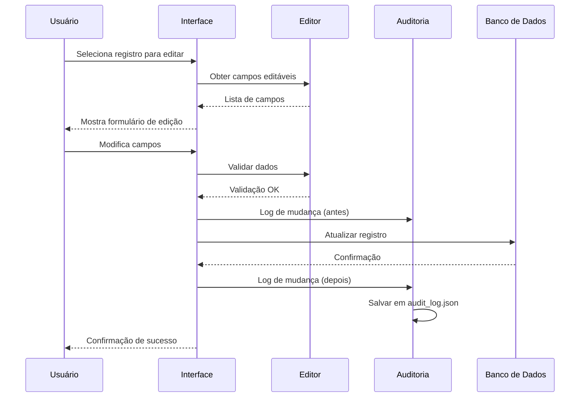
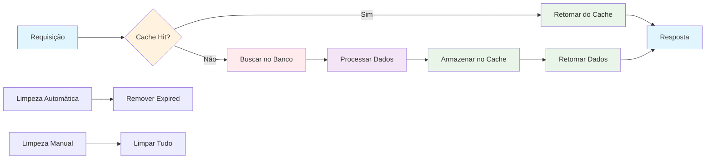

# 🔄 Fluxograma do Sistema ConsultaVD v2.0

## 📋 Visão Geral do Fluxo



## 🏗️ Arquitetura Modular



## 🔄 Fluxo de Busca Guiada



## 🔄 Fluxo de Edição de Dados



## 📊 Fluxo de Cache



## 🎯 Pontos de Decisão

### 1. **Busca Unificada vs Busca Guiada**
- **Busca Unificada**: Para termos genéricos, múltiplos critérios
- **Busca Guiada**: Para navegação hierárquica (Loja > Operadora > Circuito)

### 2. **Cache vs Banco Direto**
- **Cache**: Para consultas frequentes, dados estáticos
- **Banco Direto**: Para dados em tempo real, consultas complexas

### 3. **Validação de Dados**
- **Cliente**: Validação básica de formato
- **Servidor**: Validação de negócio, integridade

## 🔧 Pontos de Integração

1. **Streamlit ↔ Módulos**: Interface principal
2. **Módulos ↔ Banco**: Acesso a dados
3. **Módulos ↔ Cache**: Performance
4. **Editor ↔ Auditoria**: Rastreabilidade
5. **UI ↔ Validação**: Qualidade dos dados

# 🔄 Fluxograma do Sistema ConsultaVD v2.0

## 📋 Visão Geral do Fluxo


## 🏗️ Arquitetura Modular


## 🔄 Fluxo de Busca Guiada


## 🔄 Fluxo de Edição de Dados


## 📊 Fluxo de Cache


## 🎯 Pontos de Decisão

### 1. **Busca Unificada vs Busca Guiada**
- **Busca Unificada**: Para termos genéricos, múltiplos critérios
- **Busca Guiada**: Para navegação hierárquica (Loja > Operadora > Circuito)

### 2. **Cache vs Banco Direto**
- **Cache**: Para consultas frequentes, dados estáticos
- **Banco Direto**: Para dados em tempo real, consultas complexas

### 3. **Validação de Dados**
- **Cliente**: Validação básica de formato
- **Servidor**: Validação de negócio, integridade

## 🔧 Pontos de Integração

1. **Streamlit ↔ Módulos**: Interface principal
2. **Módulos ↔ Banco**: Acesso a dados
3. **Módulos ↔ Cache**: Performance
4. **Editor ↔ Auditoria**: Rastreabilidade
5. **UI ↔ Validação**: Qualidade dos dados

# 🔄 Fluxograma do Sistema ConsultaVD v2.0

## 📋 Visão Geral do Fluxo


## 🏗️ Arquitetura Modular


## 🔄 Fluxo de Busca Guiada


## 🔄 Fluxo de Edição de Dados


## 📊 Fluxo de Cache


## 🎯 Pontos de Decisão

### 1. **Busca Unificada vs Busca Guiada**
- **Busca Unificada**: Para termos genéricos, múltiplos critérios
- **Busca Guiada**: Para navegação hierárquica (Loja > Operadora > Circuito)

### 2. **Cache vs Banco Direto**
- **Cache**: Para consultas frequentes, dados estáticos
- **Banco Direto**: Para dados em tempo real, consultas complexas

### 3. **Validação de Dados**
- **Cliente**: Validação básica de formato
- **Servidor**: Validação de negócio, integridade

## 🔧 Pontos de Integração

1. **Streamlit ↔ Módulos**: Interface principal
2. **Módulos ↔ Banco**: Acesso a dados
3. **Módulos ↔ Cache**: Performance
4. **Editor ↔ Auditoria**: Rastreabilidade
5. **UI ↔ Validação**: Qualidade dos dados

# 🔄 Fluxograma do Sistema ConsultaVD v2.0

## 📋 Visão Geral do Fluxo


## 🏗️ Arquitetura Modular


## 🔄 Fluxo de Busca Guiada


## 🔄 Fluxo de Edição de Dados


## 📊 Fluxo de Cache


## 🎯 Pontos de Decisão

### 1. **Busca Unificada vs Busca Guiada**
- **Busca Unificada**: Para termos genéricos, múltiplos critérios
- **Busca Guiada**: Para navegação hierárquica (Loja > Operadora > Circuito)

### 2. **Cache vs Banco Direto**
- **Cache**: Para consultas frequentes, dados estáticos
- **Banco Direto**: Para dados em tempo real, consultas complexas

### 3. **Validação de Dados**
- **Cliente**: Validação básica de formato
- **Servidor**: Validação de negócio, integridade

## 🔧 Pontos de Integração

1. **Streamlit ↔ Módulos**: Interface principal
2. **Módulos ↔ Banco**: Acesso a dados
3. **Módulos ↔ Cache**: Performance
4. **Editor ↔ Auditoria**: Rastreabilidade
5. **UI ↔ Validação**: Qualidade dos dados

# 🔄 Fluxograma do Sistema ConsultaVD v2.0

## 📋 Visão Geral do Fluxo

```mermaid
graph TD
    A[Usuário Acessa Sistema] --> B[Streamlit Interface]
    B --> C{Menu Principal}
    
    C --> D[📊 Dashboard]
    C --> E[🔍 Busca Unificada]
    C --> F[🔎 Busca Guiada]
    C --> G[✏️ Edição de Dados]
    C --> H[📋 Auditoria]
    C --> I[📊 Visualizar Tabelas]
    C --> J[🔧 Consulta SQL]
    C --> K[🗄️ Cache Management]
    
    D --> D1[Estatísticas do Sistema]
    D1 --> D2[Cache Performance]
    
    E --> E1[Busca por People/PEOP]
    E --> E2[Busca por Designação]
    E --> E3[Busca por ID Vivo]
    E --> E4[Busca por Endereço]
    E --> E5[Busca por GGL/GR]
    
    F --> F1[Selecionar Loja]
    F1 --> F2[Selecionar Operadora]
    F2 --> F3[Selecionar Circuito]
    F3 --> F4[Exibir Resultados]
    
    G --> G1[Selecionar Tabela]
    G1 --> G2[Editar Campos]
    G2 --> G3[Validar Dados]
    G3 --> G4[Salvar Alterações]
    G4 --> G5[Log de Auditoria]
    
    H --> H1[Visualizar Logs]
    H1 --> H2[Filtrar por Data/Usuário]
    
    I --> I1[Listar Tabelas]
    I1 --> I2[Visualizar Dados]
    I2 --> I3[Exportar Dados]
    
    J --> J1[Interface SQL]
    J1 --> J2[Executar Query]
    J2 --> J3[Exibir Resultados]
    
    K --> K1[Gerenciar Cache]
    K1 --> K2[Limpar Cache]
    K2 --> K3[Métricas de Performance]
    
    style A fill:#e1f5fe
    style B fill:#f3e5f5
    style C fill:#fff3e0
    style D fill:#e8f5e8
    style E fill:#e8f5e8
    style F fill:#e8f5e8
    style G fill:#e8f5e8
    style H fill:#e8f5e8
    style I fill:#e8f5e8
    style J fill:#e8f5e8
    style K fill:#e8f5e8
```

## 🏗️ Arquitetura Modular

```mermaid
graph TB
    subgraph "Interface (Streamlit)"
        UI[app_modular.py]
        CONFIG[config.py]
    end
    
    subgraph "Camada de UI (src/ui/)"
        COMP[components.py]
        STAMPS[stamps.py]
        VALID[validation.py]
        RESP[responsive.py]
        CACHE[cache_management.py]
        SEARCH[search_loja_operadora_circuito.py]
    end
    
    subgraph "Camada de Editor (src/editor/)"
        AUDIT[audit.py]
        OPS[operations.py]
        FIELDS[fields.py]
    end
    
    subgraph "Camada de Dados (src/database/)"
        CONN[connection.py]
        QUERIES[queries.py]
    end
    
    subgraph "Sistema de Cache (src/cache/)"
        MEMORY[memory_cache.py]
    end
    
    subgraph "Dados"
        DB[(consulta_vd.db)]
        LOGS[logs/audit_log.json]
    end
    
    UI --> CONFIG
    UI --> COMP
    UI --> STAMPS
    UI --> VALID
    UI --> RESP
    UI --> CACHE
    UI --> SEARCH
    
    COMP --> AUDIT
    COMP --> OPS
    COMP --> FIELDS
    
    OPS --> CONN
    AUDIT --> LOGS
    CONN --> DB
    QUERIES --> CONN
    QUERIES --> MEMORY
    
    style UI fill:#e3f2fd
    style CONFIG fill:#e3f2fd
    style COMP fill:#f3e5f5
    style STAMPS fill:#f3e5f5
    style VALID fill:#f3e5f5
    style RESP fill:#f3e5f5
    style CACHE fill:#f3e5f5
    style SEARCH fill:#f3e5f5
    style AUDIT fill:#fff3e0
    style OPS fill:#fff3e0
    style FIELDS fill:#fff3e0
    style CONN fill:#e8f5e8
    style QUERIES fill:#e8f5e8
    style MEMORY fill:#fce4ec
    style DB fill:#f1f8e9
    style LOGS fill:#f1f8e9
```

## 🔄 Fluxo de Busca Guiada

```mermaid
sequenceDiagram
    participant U as Usuário
    participant UI as Interface
    participant DB as Banco de Dados
    participant C as Cache
    
    U->>UI: Digita nome da loja
    UI->>DB: Buscar lojas filtradas
    DB-->>UI: Lista de lojas
    UI-->>U: Mostra selectbox de lojas
    
    U->>UI: Seleciona loja
    UI->>C: Verificar cache
    C-->>UI: Cache miss
    UI->>DB: Buscar operadoras da loja
    DB-->>UI: Lista de operadoras
    UI->>C: Armazenar no cache
    UI-->>U: Mostra selectbox de operadoras
    
    U->>UI: Seleciona operadora
    UI->>C: Verificar cache
    C-->>UI: Cache hit
    UI->>DB: Buscar circuitos da loja+operadora
    DB-->>UI: Lista de circuitos
    UI->>U: Mostra selectbox de circuitos
    
    U->>UI: Seleciona circuito
    UI->>DB: Buscar detalhes do circuito
    DB-->>UI: Dados completos
    UI->>UI: Gerar carimbo
    UI-->>U: Exibir resultados + carimbo
```

## 🔄 Fluxo de Edição de Dados

```mermaid
sequenceDiagram
    participant U as Usuário
    participant UI as Interface
    participant E as Editor
    participant A as Auditoria
    participant DB as Banco de Dados
    
    U->>UI: Seleciona registro para editar
    UI->>E: Obter campos editáveis
    E-->>UI: Lista de campos
    UI-->>U: Mostra formulário de edição
    
    U->>UI: Modifica campos
    UI->>E: Validar dados
    E-->>UI: Validação OK
    
    UI->>A: Log de mudança (antes)
    UI->>DB: Atualizar registro
    DB-->>UI: Confirmação
    UI->>A: Log de mudança (depois)
    A->>A: Salvar em audit_log.json
    
    UI-->>U: Confirmação de sucesso
```

## 📊 Fluxo de Cache

```mermaid
graph LR
    A[Requisição] --> B{Cache Hit?}
    B -->|Sim| C[Retornar do Cache]
    B -->|Não| D[Buscar no Banco]
    D --> E[Processar Dados]
    E --> F[Armazenar no Cache]
    F --> G[Retornar Dados]
    C --> H[Resposta]
    G --> H
    
    I[Limpeza Automática] --> J[Remover Expired]
    K[Limpeza Manual] --> L[Limpar Tudo]
    
    style A fill:#e1f5fe
    style B fill:#fff3e0
    style C fill:#e8f5e8
    style D fill:#ffebee
    style E fill:#f3e5f5
    style F fill:#e8f5e8
    style G fill:#e8f5e8
    style H fill:#e1f5fe
```

## 🎯 Pontos de Decisão

### 1. **Busca Unificada vs Busca Guiada**
- **Busca Unificada**: Para termos genéricos, múltiplos critérios
- **Busca Guiada**: Para navegação hierárquica (Loja > Operadora > Circuito)

### 2. **Cache vs Banco Direto**
- **Cache**: Para consultas frequentes, dados estáticos
- **Banco Direto**: Para dados em tempo real, consultas complexas

### 3. **Validação de Dados**
- **Cliente**: Validação básica de formato
- **Servidor**: Validação de negócio, integridade

## 🔧 Pontos de Integração

1. **Streamlit ↔ Módulos**: Interface principal
2. **Módulos ↔ Banco**: Acesso a dados
3. **Módulos ↔ Cache**: Performance
4. **Editor ↔ Auditoria**: Rastreabilidade
5. **UI ↔ Validação**: Qualidade dos dados

# 🔄 Fluxograma do Sistema ConsultaVD v2.0

## 📋 Visão Geral do Fluxo

```mermaid
graph TD
    A[Usuário Acessa Sistema] --> B[Streamlit Interface]
    B --> C{Menu Principal}
    
    C --> D[📊 Dashboard]
    C --> E[🔍 Busca Unificada]
    C --> F[🔎 Busca Guiada]
    C --> G[✏️ Edição de Dados]
    C --> H[📋 Auditoria]
    C --> I[📊 Visualizar Tabelas]
    C --> J[🔧 Consulta SQL]
    C --> K[🗄️ Cache Management]
    
    D --> D1[Estatísticas do Sistema]
    D1 --> D2[Cache Performance]
    
    E --> E1[Busca por People/PEOP]
    E --> E2[Busca por Designação]
    E --> E3[Busca por ID Vivo]
    E --> E4[Busca por Endereço]
    E --> E5[Busca por GGL/GR]
    
    F --> F1[Selecionar Loja]
    F1 --> F2[Selecionar Operadora]
    F2 --> F3[Selecionar Circuito]
    F3 --> F4[Exibir Resultados]
    
    G --> G1[Selecionar Tabela]
    G1 --> G2[Editar Campos]
    G2 --> G3[Validar Dados]
    G3 --> G4[Salvar Alterações]
    G4 --> G5[Log de Auditoria]
    
    H --> H1[Visualizar Logs]
    H1 --> H2[Filtrar por Data/Usuário]
    
    I --> I1[Listar Tabelas]
    I1 --> I2[Visualizar Dados]
    I2 --> I3[Exportar Dados]
    
    J --> J1[Interface SQL]
    J1 --> J2[Executar Query]
    J2 --> J3[Exibir Resultados]
    
    K --> K1[Gerenciar Cache]
    K1 --> K2[Limpar Cache]
    K2 --> K3[Métricas de Performance]
    
    style A fill:#e1f5fe
    style B fill:#f3e5f5
    style C fill:#fff3e0
    style D fill:#e8f5e8
    style E fill:#e8f5e8
    style F fill:#e8f5e8
    style G fill:#e8f5e8
    style H fill:#e8f5e8
    style I fill:#e8f5e8
    style J fill:#e8f5e8
    style K fill:#e8f5e8
```

## 🏗️ Arquitetura Modular

```mermaid
graph TB
    subgraph "Interface (Streamlit)"
        UI[app_modular.py]
        CONFIG[config.py]
    end
    
    subgraph "Camada de UI (src/ui/)"
        COMP[components.py]
        STAMPS[stamps.py]
        VALID[validation.py]
        RESP[responsive.py]
        CACHE[cache_management.py]
        SEARCH[search_loja_operadora_circuito.py]
    end
    
    subgraph "Camada de Editor (src/editor/)"
        AUDIT[audit.py]
        OPS[operations.py]
        FIELDS[fields.py]
    end
    
    subgraph "Camada de Dados (src/database/)"
        CONN[connection.py]
        QUERIES[queries.py]
    end
    
    subgraph "Sistema de Cache (src/cache/)"
        MEMORY[memory_cache.py]
    end
    
    subgraph "Dados"
        DB[(consulta_vd.db)]
        LOGS[logs/audit_log.json]
    end
    
    UI --> CONFIG
    UI --> COMP
    UI --> STAMPS
    UI --> VALID
    UI --> RESP
    UI --> CACHE
    UI --> SEARCH
    
    COMP --> AUDIT
    COMP --> OPS
    COMP --> FIELDS
    
    OPS --> CONN
    AUDIT --> LOGS
    CONN --> DB
    QUERIES --> CONN
    QUERIES --> MEMORY
    
    style UI fill:#e3f2fd
    style CONFIG fill:#e3f2fd
    style COMP fill:#f3e5f5
    style STAMPS fill:#f3e5f5
    style VALID fill:#f3e5f5
    style RESP fill:#f3e5f5
    style CACHE fill:#f3e5f5
    style SEARCH fill:#f3e5f5
    style AUDIT fill:#fff3e0
    style OPS fill:#fff3e0
    style FIELDS fill:#fff3e0
    style CONN fill:#e8f5e8
    style QUERIES fill:#e8f5e8
    style MEMORY fill:#fce4ec
    style DB fill:#f1f8e9
    style LOGS fill:#f1f8e9
```

## 🔄 Fluxo de Busca Guiada

```mermaid
sequenceDiagram
    participant U as Usuário
    participant UI as Interface
    participant DB as Banco de Dados
    participant C as Cache
    
    U->>UI: Digita nome da loja
    UI->>DB: Buscar lojas filtradas
    DB-->>UI: Lista de lojas
    UI-->>U: Mostra selectbox de lojas
    
    U->>UI: Seleciona loja
    UI->>C: Verificar cache
    C-->>UI: Cache miss
    UI->>DB: Buscar operadoras da loja
    DB-->>UI: Lista de operadoras
    UI->>C: Armazenar no cache
    UI-->>U: Mostra selectbox de operadoras
    
    U->>UI: Seleciona operadora
    UI->>C: Verificar cache
    C-->>UI: Cache hit
    UI->>DB: Buscar circuitos da loja+operadora
    DB-->>UI: Lista de circuitos
    UI->>U: Mostra selectbox de circuitos
    
    U->>UI: Seleciona circuito
    UI->>DB: Buscar detalhes do circuito
    DB-->>UI: Dados completos
    UI->>UI: Gerar carimbo
    UI-->>U: Exibir resultados + carimbo
```

## 🔄 Fluxo de Edição de Dados

```mermaid
sequenceDiagram
    participant U as Usuário
    participant UI as Interface
    participant E as Editor
    participant A as Auditoria
    participant DB as Banco de Dados
    
    U->>UI: Seleciona registro para editar
    UI->>E: Obter campos editáveis
    E-->>UI: Lista de campos
    UI-->>U: Mostra formulário de edição
    
    U->>UI: Modifica campos
    UI->>E: Validar dados
    E-->>UI: Validação OK
    
    UI->>A: Log de mudança (antes)
    UI->>DB: Atualizar registro
    DB-->>UI: Confirmação
    UI->>A: Log de mudança (depois)
    A->>A: Salvar em audit_log.json
    
    UI-->>U: Confirmação de sucesso
```

## 📊 Fluxo de Cache

```mermaid
graph LR
    A[Requisição] --> B{Cache Hit?}
    B -->|Sim| C[Retornar do Cache]
    B -->|Não| D[Buscar no Banco]
    D --> E[Processar Dados]
    E --> F[Armazenar no Cache]
    F --> G[Retornar Dados]
    C --> H[Resposta]
    G --> H
    
    I[Limpeza Automática] --> J[Remover Expired]
    K[Limpeza Manual] --> L[Limpar Tudo]
    
    style A fill:#e1f5fe
    style B fill:#fff3e0
    style C fill:#e8f5e8
    style D fill:#ffebee
    style E fill:#f3e5f5
    style F fill:#e8f5e8
    style G fill:#e8f5e8
    style H fill:#e1f5fe
```

## 🎯 Pontos de Decisão

### 1. **Busca Unificada vs Busca Guiada**
- **Busca Unificada**: Para termos genéricos, múltiplos critérios
- **Busca Guiada**: Para navegação hierárquica (Loja > Operadora > Circuito)

### 2. **Cache vs Banco Direto**
- **Cache**: Para consultas frequentes, dados estáticos
- **Banco Direto**: Para dados em tempo real, consultas complexas

### 3. **Validação de Dados**
- **Cliente**: Validação básica de formato
- **Servidor**: Validação de negócio, integridade

## 🔧 Pontos de Integração

1. **Streamlit ↔ Módulos**: Interface principal
2. **Módulos ↔ Banco**: Acesso a dados
3. **Módulos ↔ Cache**: Performance
4. **Editor ↔ Auditoria**: Rastreabilidade
5. **UI ↔ Validação**: Qualidade dos dados

# 🔄 Fluxograma do Sistema ConsultaVD v2.0

## 📋 Visão Geral do Fluxo

```mermaid
graph TD
    A[Usuário Acessa Sistema] --> B[Streamlit Interface]
    B --> C{Menu Principal}
    
    C --> D[📊 Dashboard]
    C --> E[🔍 Busca Unificada]
    C --> F[🔎 Busca Guiada]
    C --> G[✏️ Edição de Dados]
    C --> H[📋 Auditoria]
    C --> I[📊 Visualizar Tabelas]
    C --> J[🔧 Consulta SQL]
    C --> K[🗄️ Cache Management]
    
    D --> D1[Estatísticas do Sistema]
    D1 --> D2[Cache Performance]
    
    E --> E1[Busca por People/PEOP]
    E --> E2[Busca por Designação]
    E --> E3[Busca por ID Vivo]
    E --> E4[Busca por Endereço]
    E --> E5[Busca por GGL/GR]
    
    F --> F1[Selecionar Loja]
    F1 --> F2[Selecionar Operadora]
    F2 --> F3[Selecionar Circuito]
    F3 --> F4[Exibir Resultados]
    
    G --> G1[Selecionar Tabela]
    G1 --> G2[Editar Campos]
    G2 --> G3[Validar Dados]
    G3 --> G4[Salvar Alterações]
    G4 --> G5[Log de Auditoria]
    
    H --> H1[Visualizar Logs]
    H1 --> H2[Filtrar por Data/Usuário]
    
    I --> I1[Listar Tabelas]
    I1 --> I2[Visualizar Dados]
    I2 --> I3[Exportar Dados]
    
    J --> J1[Interface SQL]
    J1 --> J2[Executar Query]
    J2 --> J3[Exibir Resultados]
    
    K --> K1[Gerenciar Cache]
    K1 --> K2[Limpar Cache]
    K2 --> K3[Métricas de Performance]
    
    style A fill:#e1f5fe
    style B fill:#f3e5f5
    style C fill:#fff3e0
    style D fill:#e8f5e8
    style E fill:#e8f5e8
    style F fill:#e8f5e8
    style G fill:#e8f5e8
    style H fill:#e8f5e8
    style I fill:#e8f5e8
    style J fill:#e8f5e8
    style K fill:#e8f5e8
```

## 🏗️ Arquitetura Modular

```mermaid
graph TB
    subgraph "Interface (Streamlit)"
        UI[app_modular.py]
        CONFIG[config.py]
    end
    
    subgraph "Camada de UI (src/ui/)"
        COMP[components.py]
        STAMPS[stamps.py]
        VALID[validation.py]
        RESP[responsive.py]
        CACHE[cache_management.py]
        SEARCH[search_loja_operadora_circuito.py]
    end
    
    subgraph "Camada de Editor (src/editor/)"
        AUDIT[audit.py]
        OPS[operations.py]
        FIELDS[fields.py]
    end
    
    subgraph "Camada de Dados (src/database/)"
        CONN[connection.py]
        QUERIES[queries.py]
    end
    
    subgraph "Sistema de Cache (src/cache/)"
        MEMORY[memory_cache.py]
    end
    
    subgraph "Dados"
        DB[(consulta_vd.db)]
        LOGS[logs/audit_log.json]
    end
    
    UI --> CONFIG
    UI --> COMP
    UI --> STAMPS
    UI --> VALID
    UI --> RESP
    UI --> CACHE
    UI --> SEARCH
    
    COMP --> AUDIT
    COMP --> OPS
    COMP --> FIELDS
    
    OPS --> CONN
    AUDIT --> LOGS
    CONN --> DB
    QUERIES --> CONN
    QUERIES --> MEMORY
    
    style UI fill:#e3f2fd
    style CONFIG fill:#e3f2fd
    style COMP fill:#f3e5f5
    style STAMPS fill:#f3e5f5
    style VALID fill:#f3e5f5
    style RESP fill:#f3e5f5
    style CACHE fill:#f3e5f5
    style SEARCH fill:#f3e5f5
    style AUDIT fill:#fff3e0
    style OPS fill:#fff3e0
    style FIELDS fill:#fff3e0
    style CONN fill:#e8f5e8
    style QUERIES fill:#e8f5e8
    style MEMORY fill:#fce4ec
    style DB fill:#f1f8e9
    style LOGS fill:#f1f8e9
```

## 🔄 Fluxo de Busca Guiada

```mermaid
sequenceDiagram
    participant U as Usuário
    participant UI as Interface
    participant DB as Banco de Dados
    participant C as Cache
    
    U->>UI: Digita nome da loja
    UI->>DB: Buscar lojas filtradas
    DB-->>UI: Lista de lojas
    UI-->>U: Mostra selectbox de lojas
    
    U->>UI: Seleciona loja
    UI->>C: Verificar cache
    C-->>UI: Cache miss
    UI->>DB: Buscar operadoras da loja
    DB-->>UI: Lista de operadoras
    UI->>C: Armazenar no cache
    UI-->>U: Mostra selectbox de operadoras
    
    U->>UI: Seleciona operadora
    UI->>C: Verificar cache
    C-->>UI: Cache hit
    UI->>DB: Buscar circuitos da loja+operadora
    DB-->>UI: Lista de circuitos
    UI->>U: Mostra selectbox de circuitos
    
    U->>UI: Seleciona circuito
    UI->>DB: Buscar detalhes do circuito
    DB-->>UI: Dados completos
    UI->>UI: Gerar carimbo
    UI-->>U: Exibir resultados + carimbo
```

## 🔄 Fluxo de Edição de Dados

```mermaid
sequenceDiagram
    participant U as Usuário
    participant UI as Interface
    participant E as Editor
    participant A as Auditoria
    participant DB as Banco de Dados
    
    U->>UI: Seleciona registro para editar
    UI->>E: Obter campos editáveis
    E-->>UI: Lista de campos
    UI-->>U: Mostra formulário de edição
    
    U->>UI: Modifica campos
    UI->>E: Validar dados
    E-->>UI: Validação OK
    
    UI->>A: Log de mudança (antes)
    UI->>DB: Atualizar registro
    DB-->>UI: Confirmação
    UI->>A: Log de mudança (depois)
    A->>A: Salvar em audit_log.json
    
    UI-->>U: Confirmação de sucesso
```

## 📊 Fluxo de Cache

```mermaid
graph LR
    A[Requisição] --> B{Cache Hit?}
    B -->|Sim| C[Retornar do Cache]
    B -->|Não| D[Buscar no Banco]
    D --> E[Processar Dados]
    E --> F[Armazenar no Cache]
    F --> G[Retornar Dados]
    C --> H[Resposta]
    G --> H
    
    I[Limpeza Automática] --> J[Remover Expired]
    K[Limpeza Manual] --> L[Limpar Tudo]
    
    style A fill:#e1f5fe
    style B fill:#fff3e0
    style C fill:#e8f5e8
    style D fill:#ffebee
    style E fill:#f3e5f5
    style F fill:#e8f5e8
    style G fill:#e8f5e8
    style H fill:#e1f5fe
```

## 🎯 Pontos de Decisão

### 1. **Busca Unificada vs Busca Guiada**
- **Busca Unificada**: Para termos genéricos, múltiplos critérios
- **Busca Guiada**: Para navegação hierárquica (Loja > Operadora > Circuito)

### 2. **Cache vs Banco Direto**
- **Cache**: Para consultas frequentes, dados estáticos
- **Banco Direto**: Para dados em tempo real, consultas complexas

### 3. **Validação de Dados**
- **Cliente**: Validação básica de formato
- **Servidor**: Validação de negócio, integridade

## 🔧 Pontos de Integração

1. **Streamlit ↔ Módulos**: Interface principal
2. **Módulos ↔ Banco**: Acesso a dados
3. **Módulos ↔ Cache**: Performance
4. **Editor ↔ Auditoria**: Rastreabilidade
5. **UI ↔ Validação**: Qualidade dos dados

# 🔄 Fluxograma do Sistema ConsultaVD v2.0

## 📋 Visão Geral do Fluxo

```mermaid
graph TD
    A[Usuário Acessa Sistema] --> B[Streamlit Interface]
    B --> C{Menu Principal}
    
    C --> D[📊 Dashboard]
    C --> E[🔍 Busca Unificada]
    C --> F[🔎 Busca Guiada]
    C --> G[✏️ Edição de Dados]
    C --> H[📋 Auditoria]
    C --> I[📊 Visualizar Tabelas]
    C --> J[🔧 Consulta SQL]
    C --> K[🗄️ Cache Management]
    
    D --> D1[Estatísticas do Sistema]
    D1 --> D2[Cache Performance]
    
    E --> E1[Busca por People/PEOP]
    E --> E2[Busca por Designação]
    E --> E3[Busca por ID Vivo]
    E --> E4[Busca por Endereço]
    E --> E5[Busca por GGL/GR]
    
    F --> F1[Selecionar Loja]
    F1 --> F2[Selecionar Operadora]
    F2 --> F3[Selecionar Circuito]
    F3 --> F4[Exibir Resultados]
    
    G --> G1[Selecionar Tabela]
    G1 --> G2[Editar Campos]
    G2 --> G3[Validar Dados]
    G3 --> G4[Salvar Alterações]
    G4 --> G5[Log de Auditoria]
    
    H --> H1[Visualizar Logs]
    H1 --> H2[Filtrar por Data/Usuário]
    
    I --> I1[Listar Tabelas]
    I1 --> I2[Visualizar Dados]
    I2 --> I3[Exportar Dados]
    
    J --> J1[Interface SQL]
    J1 --> J2[Executar Query]
    J2 --> J3[Exibir Resultados]
    
    K --> K1[Gerenciar Cache]
    K1 --> K2[Limpar Cache]
    K2 --> K3[Métricas de Performance]
    
    style A fill:#e1f5fe
    style B fill:#f3e5f5
    style C fill:#fff3e0
    style D fill:#e8f5e8
    style E fill:#e8f5e8
    style F fill:#e8f5e8
    style G fill:#e8f5e8
    style H fill:#e8f5e8
    style I fill:#e8f5e8
    style J fill:#e8f5e8
    style K fill:#e8f5e8
```

## 🏗️ Arquitetura Modular

```mermaid
graph TB
    subgraph "Interface (Streamlit)"
        UI[app_modular.py]
        CONFIG[config.py]
    end
    
    subgraph "Camada de UI (src/ui/)"
        COMP[components.py]
        STAMPS[stamps.py]
        VALID[validation.py]
        RESP[responsive.py]
        CACHE[cache_management.py]
        SEARCH[search_loja_operadora_circuito.py]
    end
    
    subgraph "Camada de Editor (src/editor/)"
        AUDIT[audit.py]
        OPS[operations.py]
        FIELDS[fields.py]
    end
    
    subgraph "Camada de Dados (src/database/)"
        CONN[connection.py]
        QUERIES[queries.py]
    end
    
    subgraph "Sistema de Cache (src/cache/)"
        MEMORY[memory_cache.py]
    end
    
    subgraph "Dados"
        DB[(consulta_vd.db)]
        LOGS[logs/audit_log.json]
    end
    
    UI --> CONFIG
    UI --> COMP
    UI --> STAMPS
    UI --> VALID
    UI --> RESP
    UI --> CACHE
    UI --> SEARCH
    
    COMP --> AUDIT
    COMP --> OPS
    COMP --> FIELDS
    
    OPS --> CONN
    AUDIT --> LOGS
    CONN --> DB
    QUERIES --> CONN
    QUERIES --> MEMORY
    
    style UI fill:#e3f2fd
    style CONFIG fill:#e3f2fd
    style COMP fill:#f3e5f5
    style STAMPS fill:#f3e5f5
    style VALID fill:#f3e5f5
    style RESP fill:#f3e5f5
    style CACHE fill:#f3e5f5
    style SEARCH fill:#f3e5f5
    style AUDIT fill:#fff3e0
    style OPS fill:#fff3e0
    style FIELDS fill:#fff3e0
    style CONN fill:#e8f5e8
    style QUERIES fill:#e8f5e8
    style MEMORY fill:#fce4ec
    style DB fill:#f1f8e9
    style LOGS fill:#f1f8e9
```

## 🔄 Fluxo de Busca Guiada

```mermaid
sequenceDiagram
    participant U as Usuário
    participant UI as Interface
    participant DB as Banco de Dados
    participant C as Cache
    
    U->>UI: Digita nome da loja
    UI->>DB: Buscar lojas filtradas
    DB-->>UI: Lista de lojas
    UI-->>U: Mostra selectbox de lojas
    
    U->>UI: Seleciona loja
    UI->>C: Verificar cache
    C-->>UI: Cache miss
    UI->>DB: Buscar operadoras da loja
    DB-->>UI: Lista de operadoras
    UI->>C: Armazenar no cache
    UI-->>U: Mostra selectbox de operadoras
    
    U->>UI: Seleciona operadora
    UI->>C: Verificar cache
    C-->>UI: Cache hit
    UI->>DB: Buscar circuitos da loja+operadora
    DB-->>UI: Lista de circuitos
    UI->>U: Mostra selectbox de circuitos
    
    U->>UI: Seleciona circuito
    UI->>DB: Buscar detalhes do circuito
    DB-->>UI: Dados completos
    UI->>UI: Gerar carimbo
    UI-->>U: Exibir resultados + carimbo
```

## 🔄 Fluxo de Edição de Dados

```mermaid
sequenceDiagram
    participant U as Usuário
    participant UI as Interface
    participant E as Editor
    participant A as Auditoria
    participant DB as Banco de Dados
    
    U->>UI: Seleciona registro para editar
    UI->>E: Obter campos editáveis
    E-->>UI: Lista de campos
    UI-->>U: Mostra formulário de edição
    
    U->>UI: Modifica campos
    UI->>E: Validar dados
    E-->>UI: Validação OK
    
    UI->>A: Log de mudança (antes)
    UI->>DB: Atualizar registro
    DB-->>UI: Confirmação
    UI->>A: Log de mudança (depois)
    A->>A: Salvar em audit_log.json
    
    UI-->>U: Confirmação de sucesso
```

## 📊 Fluxo de Cache

```mermaid
graph LR
    A[Requisição] --> B{Cache Hit?}
    B -->|Sim| C[Retornar do Cache]
    B -->|Não| D[Buscar no Banco]
    D --> E[Processar Dados]
    E --> F[Armazenar no Cache]
    F --> G[Retornar Dados]
    C --> H[Resposta]
    G --> H
    
    I[Limpeza Automática] --> J[Remover Expired]
    K[Limpeza Manual] --> L[Limpar Tudo]
    
    style A fill:#e1f5fe
    style B fill:#fff3e0
    style C fill:#e8f5e8
    style D fill:#ffebee
    style E fill:#f3e5f5
    style F fill:#e8f5e8
    style G fill:#e8f5e8
    style H fill:#e1f5fe
```

## 🎯 Pontos de Decisão

### 1. **Busca Unificada vs Busca Guiada**
- **Busca Unificada**: Para termos genéricos, múltiplos critérios
- **Busca Guiada**: Para navegação hierárquica (Loja > Operadora > Circuito)

### 2. **Cache vs Banco Direto**
- **Cache**: Para consultas frequentes, dados estáticos
- **Banco Direto**: Para dados em tempo real, consultas complexas

### 3. **Validação de Dados**
- **Cliente**: Validação básica de formato
- **Servidor**: Validação de negócio, integridade

## 🔧 Pontos de Integração

1. **Streamlit ↔ Módulos**: Interface principal
2. **Módulos ↔ Banco**: Acesso a dados
3. **Módulos ↔ Cache**: Performance
4. **Editor ↔ Auditoria**: Rastreabilidade
5. **UI ↔ Validação**: Qualidade dos dados

# 🔄 Fluxograma do Sistema ConsultaVD v2.0

## 📋 Visão Geral do Fluxo

```mermaid
graph TD
    A[Usuário Acessa Sistema] --> B[Streamlit Interface]
    B --> C{Menu Principal}
    
    C --> D[📊 Dashboard]
    C --> E[🔍 Busca Unificada]
    C --> F[🔎 Busca Guiada]
    C --> G[✏️ Edição de Dados]
    C --> H[📋 Auditoria]
    C --> I[📊 Visualizar Tabelas]
    C --> J[🔧 Consulta SQL]
    C --> K[🗄️ Cache Management]
    
    D --> D1[Estatísticas do Sistema]
    D1 --> D2[Cache Performance]
    
    E --> E1[Busca por People/PEOP]
    E --> E2[Busca por Designação]
    E --> E3[Busca por ID Vivo]
    E --> E4[Busca por Endereço]
    E --> E5[Busca por GGL/GR]
    
    F --> F1[Selecionar Loja]
    F1 --> F2[Selecionar Operadora]
    F2 --> F3[Selecionar Circuito]
    F3 --> F4[Exibir Resultados]
    
    G --> G1[Selecionar Tabela]
    G1 --> G2[Editar Campos]
    G2 --> G3[Validar Dados]
    G3 --> G4[Salvar Alterações]
    G4 --> G5[Log de Auditoria]
    
    H --> H1[Visualizar Logs]
    H1 --> H2[Filtrar por Data/Usuário]
    
    I --> I1[Listar Tabelas]
    I1 --> I2[Visualizar Dados]
    I2 --> I3[Exportar Dados]
    
    J --> J1[Interface SQL]
    J1 --> J2[Executar Query]
    J2 --> J3[Exibir Resultados]
    
    K --> K1[Gerenciar Cache]
    K1 --> K2[Limpar Cache]
    K2 --> K3[Métricas de Performance]
    
    style A fill:#e1f5fe
    style B fill:#f3e5f5
    style C fill:#fff3e0
    style D fill:#e8f5e8
    style E fill:#e8f5e8
    style F fill:#e8f5e8
    style G fill:#e8f5e8
    style H fill:#e8f5e8
    style I fill:#e8f5e8
    style J fill:#e8f5e8
    style K fill:#e8f5e8
```

## 🏗️ Arquitetura Modular

```mermaid
graph TB
    subgraph "Interface (Streamlit)"
        UI[app_modular.py]
        CONFIG[config.py]
    end
    
    subgraph "Camada de UI (src/ui/)"
        COMP[components.py]
        STAMPS[stamps.py]
        VALID[validation.py]
        RESP[responsive.py]
        CACHE[cache_management.py]
        SEARCH[search_loja_operadora_circuito.py]
    end
    
    subgraph "Camada de Editor (src/editor/)"
        AUDIT[audit.py]
        OPS[operations.py]
        FIELDS[fields.py]
    end
    
    subgraph "Camada de Dados (src/database/)"
        CONN[connection.py]
        QUERIES[queries.py]
    end
    
    subgraph "Sistema de Cache (src/cache/)"
        MEMORY[memory_cache.py]
    end
    
    subgraph "Dados"
        DB[(consulta_vd.db)]
        LOGS[logs/audit_log.json]
    end
    
    UI --> CONFIG
    UI --> COMP
    UI --> STAMPS
    UI --> VALID
    UI --> RESP
    UI --> CACHE
    UI --> SEARCH
    
    COMP --> AUDIT
    COMP --> OPS
    COMP --> FIELDS
    
    OPS --> CONN
    AUDIT --> LOGS
    CONN --> DB
    QUERIES --> CONN
    QUERIES --> MEMORY
    
    style UI fill:#e3f2fd
    style CONFIG fill:#e3f2fd
    style COMP fill:#f3e5f5
    style STAMPS fill:#f3e5f5
    style VALID fill:#f3e5f5
    style RESP fill:#f3e5f5
    style CACHE fill:#f3e5f5
    style SEARCH fill:#f3e5f5
    style AUDIT fill:#fff3e0
    style OPS fill:#fff3e0
    style FIELDS fill:#fff3e0
    style CONN fill:#e8f5e8
    style QUERIES fill:#e8f5e8
    style MEMORY fill:#fce4ec
    style DB fill:#f1f8e9
    style LOGS fill:#f1f8e9
```

## 🔄 Fluxo de Busca Guiada

```mermaid
sequenceDiagram
    participant U as Usuário
    participant UI as Interface
    participant DB as Banco de Dados
    participant C as Cache
    
    U->>UI: Digita nome da loja
    UI->>DB: Buscar lojas filtradas
    DB-->>UI: Lista de lojas
    UI-->>U: Mostra selectbox de lojas
    
    U->>UI: Seleciona loja
    UI->>C: Verificar cache
    C-->>UI: Cache miss
    UI->>DB: Buscar operadoras da loja
    DB-->>UI: Lista de operadoras
    UI->>C: Armazenar no cache
    UI-->>U: Mostra selectbox de operadoras
    
    U->>UI: Seleciona operadora
    UI->>C: Verificar cache
    C-->>UI: Cache hit
    UI->>DB: Buscar circuitos da loja+operadora
    DB-->>UI: Lista de circuitos
    UI->>U: Mostra selectbox de circuitos
    
    U->>UI: Seleciona circuito
    UI->>DB: Buscar detalhes do circuito
    DB-->>UI: Dados completos
    UI->>UI: Gerar carimbo
    UI-->>U: Exibir resultados + carimbo
```

## 🔄 Fluxo de Edição de Dados

```mermaid
sequenceDiagram
    participant U as Usuário
    participant UI as Interface
    participant E as Editor
    participant A as Auditoria
    participant DB as Banco de Dados
    
    U->>UI: Seleciona registro para editar
    UI->>E: Obter campos editáveis
    E-->>UI: Lista de campos
    UI-->>U: Mostra formulário de edição
    
    U->>UI: Modifica campos
    UI->>E: Validar dados
    E-->>UI: Validação OK
    
    UI->>A: Log de mudança (antes)
    UI->>DB: Atualizar registro
    DB-->>UI: Confirmação
    UI->>A: Log de mudança (depois)
    A->>A: Salvar em audit_log.json
    
    UI-->>U: Confirmação de sucesso
```

## 📊 Fluxo de Cache

```mermaid
graph LR
    A[Requisição] --> B{Cache Hit?}
    B -->|Sim| C[Retornar do Cache]
    B -->|Não| D[Buscar no Banco]
    D --> E[Processar Dados]
    E --> F[Armazenar no Cache]
    F --> G[Retornar Dados]
    C --> H[Resposta]
    G --> H
    
    I[Limpeza Automática] --> J[Remover Expired]
    K[Limpeza Manual] --> L[Limpar Tudo]
    
    style A fill:#e1f5fe
    style B fill:#fff3e0
    style C fill:#e8f5e8
    style D fill:#ffebee
    style E fill:#f3e5f5
    style F fill:#e8f5e8
    style G fill:#e8f5e8
    style H fill:#e1f5fe
```

## 🎯 Pontos de Decisão

### 1. **Busca Unificada vs Busca Guiada**
- **Busca Unificada**: Para termos genéricos, múltiplos critérios
- **Busca Guiada**: Para navegação hierárquica (Loja > Operadora > Circuito)

### 2. **Cache vs Banco Direto**
- **Cache**: Para consultas frequentes, dados estáticos
- **Banco Direto**: Para dados em tempo real, consultas complexas

### 3. **Validação de Dados**
- **Cliente**: Validação básica de formato
- **Servidor**: Validação de negócio, integridade

## 🔧 Pontos de Integração

1. **Streamlit ↔ Módulos**: Interface principal
2. **Módulos ↔ Banco**: Acesso a dados
3. **Módulos ↔ Cache**: Performance
4. **Editor ↔ Auditoria**: Rastreabilidade
5. **UI ↔ Validação**: Qualidade dos dados

# 🔄 Fluxograma do Sistema ConsultaVD v2.0

## 📋 Visão Geral do Fluxo

```mermaid
graph TD
    A[Usuário Acessa Sistema] --> B[Streamlit Interface]
    B --> C{Menu Principal}
    
    C --> D[📊 Dashboard]
    C --> E[🔍 Busca Unificada]
    C --> F[🔎 Busca Guiada]
    C --> G[✏️ Edição de Dados]
    C --> H[📋 Auditoria]
    C --> I[📊 Visualizar Tabelas]
    C --> J[🔧 Consulta SQL]
    C --> K[🗄️ Cache Management]
    
    D --> D1[Estatísticas do Sistema]
    D1 --> D2[Cache Performance]
    
    E --> E1[Busca por People/PEOP]
    E --> E2[Busca por Designação]
    E --> E3[Busca por ID Vivo]
    E --> E4[Busca por Endereço]
    E --> E5[Busca por GGL/GR]
    
    F --> F1[Selecionar Loja]
    F1 --> F2[Selecionar Operadora]
    F2 --> F3[Selecionar Circuito]
    F3 --> F4[Exibir Resultados]
    
    G --> G1[Selecionar Tabela]
    G1 --> G2[Editar Campos]
    G2 --> G3[Validar Dados]
    G3 --> G4[Salvar Alterações]
    G4 --> G5[Log de Auditoria]
    
    H --> H1[Visualizar Logs]
    H1 --> H2[Filtrar por Data/Usuário]
    
    I --> I1[Listar Tabelas]
    I1 --> I2[Visualizar Dados]
    I2 --> I3[Exportar Dados]
    
    J --> J1[Interface SQL]
    J1 --> J2[Executar Query]
    J2 --> J3[Exibir Resultados]
    
    K --> K1[Gerenciar Cache]
    K1 --> K2[Limpar Cache]
    K2 --> K3[Métricas de Performance]
    
    style A fill:#e1f5fe
    style B fill:#f3e5f5
    style C fill:#fff3e0
    style D fill:#e8f5e8
    style E fill:#e8f5e8
    style F fill:#e8f5e8
    style G fill:#e8f5e8
    style H fill:#e8f5e8
    style I fill:#e8f5e8
    style J fill:#e8f5e8
    style K fill:#e8f5e8
```

## 🏗️ Arquitetura Modular

```mermaid
graph TB
    subgraph "Interface (Streamlit)"
        UI[app_modular.py]
        CONFIG[config.py]
    end
    
    subgraph "Camada de UI (src/ui/)"
        COMP[components.py]
        STAMPS[stamps.py]
        VALID[validation.py]
        RESP[responsive.py]
        CACHE[cache_management.py]
        SEARCH[search_loja_operadora_circuito.py]
    end
    
    subgraph "Camada de Editor (src/editor/)"
        AUDIT[audit.py]
        OPS[operations.py]
        FIELDS[fields.py]
    end
    
    subgraph "Camada de Dados (src/database/)"
        CONN[connection.py]
        QUERIES[queries.py]
    end
    
    subgraph "Sistema de Cache (src/cache/)"
        MEMORY[memory_cache.py]
    end
    
    subgraph "Dados"
        DB[(consulta_vd.db)]
        LOGS[logs/audit_log.json]
    end
    
    UI --> CONFIG
    UI --> COMP
    UI --> STAMPS
    UI --> VALID
    UI --> RESP
    UI --> CACHE
    UI --> SEARCH
    
    COMP --> AUDIT
    COMP --> OPS
    COMP --> FIELDS
    
    OPS --> CONN
    AUDIT --> LOGS
    CONN --> DB
    QUERIES --> CONN
    QUERIES --> MEMORY
    
    style UI fill:#e3f2fd
    style CONFIG fill:#e3f2fd
    style COMP fill:#f3e5f5
    style STAMPS fill:#f3e5f5
    style VALID fill:#f3e5f5
    style RESP fill:#f3e5f5
    style CACHE fill:#f3e5f5
    style SEARCH fill:#f3e5f5
    style AUDIT fill:#fff3e0
    style OPS fill:#fff3e0
    style FIELDS fill:#fff3e0
    style CONN fill:#e8f5e8
    style QUERIES fill:#e8f5e8
    style MEMORY fill:#fce4ec
    style DB fill:#f1f8e9
    style LOGS fill:#f1f8e9
```

## 🔄 Fluxo de Busca Guiada

```mermaid
sequenceDiagram
    participant U as Usuário
    participant UI as Interface
    participant DB as Banco de Dados
    participant C as Cache
    
    U->>UI: Digita nome da loja
    UI->>DB: Buscar lojas filtradas
    DB-->>UI: Lista de lojas
    UI-->>U: Mostra selectbox de lojas
    
    U->>UI: Seleciona loja
    UI->>C: Verificar cache
    C-->>UI: Cache miss
    UI->>DB: Buscar operadoras da loja
    DB-->>UI: Lista de operadoras
    UI->>C: Armazenar no cache
    UI-->>U: Mostra selectbox de operadoras
    
    U->>UI: Seleciona operadora
    UI->>C: Verificar cache
    C-->>UI: Cache hit
    UI->>DB: Buscar circuitos da loja+operadora
    DB-->>UI: Lista de circuitos
    UI->>U: Mostra selectbox de circuitos
    
    U->>UI: Seleciona circuito
    UI->>DB: Buscar detalhes do circuito
    DB-->>UI: Dados completos
    UI->>UI: Gerar carimbo
    UI-->>U: Exibir resultados + carimbo
```

## 🔄 Fluxo de Edição de Dados

```mermaid
sequenceDiagram
    participant U as Usuário
    participant UI as Interface
    participant E as Editor
    participant A as Auditoria
    participant DB as Banco de Dados
    
    U->>UI: Seleciona registro para editar
    UI->>E: Obter campos editáveis
    E-->>UI: Lista de campos
    UI-->>U: Mostra formulário de edição
    
    U->>UI: Modifica campos
    UI->>E: Validar dados
    E-->>UI: Validação OK
    
    UI->>A: Log de mudança (antes)
    UI->>DB: Atualizar registro
    DB-->>UI: Confirmação
    UI->>A: Log de mudança (depois)
    A->>A: Salvar em audit_log.json
    
    UI-->>U: Confirmação de sucesso
```

## 📊 Fluxo de Cache

```mermaid
graph LR
    A[Requisição] --> B{Cache Hit?}
    B -->|Sim| C[Retornar do Cache]
    B -->|Não| D[Buscar no Banco]
    D --> E[Processar Dados]
    E --> F[Armazenar no Cache]
    F --> G[Retornar Dados]
    C --> H[Resposta]
    G --> H
    
    I[Limpeza Automática] --> J[Remover Expired]
    K[Limpeza Manual] --> L[Limpar Tudo]
    
    style A fill:#e1f5fe
    style B fill:#fff3e0
    style C fill:#e8f5e8
    style D fill:#ffebee
    style E fill:#f3e5f5
    style F fill:#e8f5e8
    style G fill:#e8f5e8
    style H fill:#e1f5fe
```

## 🎯 Pontos de Decisão

### 1. **Busca Unificada vs Busca Guiada**
- **Busca Unificada**: Para termos genéricos, múltiplos critérios
- **Busca Guiada**: Para navegação hierárquica (Loja > Operadora > Circuito)

### 2. **Cache vs Banco Direto**
- **Cache**: Para consultas frequentes, dados estáticos
- **Banco Direto**: Para dados em tempo real, consultas complexas

### 3. **Validação de Dados**
- **Cliente**: Validação básica de formato
- **Servidor**: Validação de negócio, integridade

## 🔧 Pontos de Integração

1. **Streamlit ↔ Módulos**: Interface principal
2. **Módulos ↔ Banco**: Acesso a dados
3. **Módulos ↔ Cache**: Performance
4. **Editor ↔ Auditoria**: Rastreabilidade
5. **UI ↔ Validação**: Qualidade dos dados

# 🔄 Fluxograma do Sistema ConsultaVD v2.0

## 📋 Visão Geral do Fluxo

```mermaid
graph TD
    A[Usuário Acessa Sistema] --> B[Streamlit Interface]
    B --> C{Menu Principal}
    
    C --> D[📊 Dashboard]
    C --> E[🔍 Busca Unificada]
    C --> F[🔎 Busca Guiada]
    C --> G[✏️ Edição de Dados]
    C --> H[📋 Auditoria]
    C --> I[📊 Visualizar Tabelas]
    C --> J[🔧 Consulta SQL]
    C --> K[🗄️ Cache Management]
    
    D --> D1[Estatísticas do Sistema]
    D1 --> D2[Cache Performance]
    
    E --> E1[Busca por People/PEOP]
    E --> E2[Busca por Designação]
    E --> E3[Busca por ID Vivo]
    E --> E4[Busca por Endereço]
    E --> E5[Busca por GGL/GR]
    
    F --> F1[Selecionar Loja]
    F1 --> F2[Selecionar Operadora]
    F2 --> F3[Selecionar Circuito]
    F3 --> F4[Exibir Resultados]
    
    G --> G1[Selecionar Tabela]
    G1 --> G2[Editar Campos]
    G2 --> G3[Validar Dados]
    G3 --> G4[Salvar Alterações]
    G4 --> G5[Log de Auditoria]
    
    H --> H1[Visualizar Logs]
    H1 --> H2[Filtrar por Data/Usuário]
    
    I --> I1[Listar Tabelas]
    I1 --> I2[Visualizar Dados]
    I2 --> I3[Exportar Dados]
    
    J --> J1[Interface SQL]
    J1 --> J2[Executar Query]
    J2 --> J3[Exibir Resultados]
    
    K --> K1[Gerenciar Cache]
    K1 --> K2[Limpar Cache]
    K2 --> K3[Métricas de Performance]
    
    style A fill:#e1f5fe
    style B fill:#f3e5f5
    style C fill:#fff3e0
    style D fill:#e8f5e8
    style E fill:#e8f5e8
    style F fill:#e8f5e8
    style G fill:#e8f5e8
    style H fill:#e8f5e8
    style I fill:#e8f5e8
    style J fill:#e8f5e8
    style K fill:#e8f5e8
```

## 🏗️ Arquitetura Modular

```mermaid
graph TB
    subgraph "Interface (Streamlit)"
        UI[app_modular.py]
        CONFIG[config.py]
    end
    
    subgraph "Camada de UI (src/ui/)"
        COMP[components.py]
        STAMPS[stamps.py]
        VALID[validation.py]
        RESP[responsive.py]
        CACHE[cache_management.py]
        SEARCH[search_loja_operadora_circuito.py]
    end
    
    subgraph "Camada de Editor (src/editor/)"
        AUDIT[audit.py]
        OPS[operations.py]
        FIELDS[fields.py]
    end
    
    subgraph "Camada de Dados (src/database/)"
        CONN[connection.py]
        QUERIES[queries.py]
    end
    
    subgraph "Sistema de Cache (src/cache/)"
        MEMORY[memory_cache.py]
    end
    
    subgraph "Dados"
        DB[(consulta_vd.db)]
        LOGS[logs/audit_log.json]
    end
    
    UI --> CONFIG
    UI --> COMP
    UI --> STAMPS
    UI --> VALID
    UI --> RESP
    UI --> CACHE
    UI --> SEARCH
    
    COMP --> AUDIT
    COMP --> OPS
    COMP --> FIELDS
    
    OPS --> CONN
    AUDIT --> LOGS
    CONN --> DB
    QUERIES --> CONN
    QUERIES --> MEMORY
    
    style UI fill:#e3f2fd
    style CONFIG fill:#e3f2fd
    style COMP fill:#f3e5f5
    style STAMPS fill:#f3e5f5
    style VALID fill:#f3e5f5
    style RESP fill:#f3e5f5
    style CACHE fill:#f3e5f5
    style SEARCH fill:#f3e5f5
    style AUDIT fill:#fff3e0
    style OPS fill:#fff3e0
    style FIELDS fill:#fff3e0
    style CONN fill:#e8f5e8
    style QUERIES fill:#e8f5e8
    style MEMORY fill:#fce4ec
    style DB fill:#f1f8e9
    style LOGS fill:#f1f8e9
```

## 🔄 Fluxo de Busca Guiada

```mermaid
sequenceDiagram
    participant U as Usuário
    participant UI as Interface
    participant DB as Banco de Dados
    participant C as Cache
    
    U->>UI: Digita nome da loja
    UI->>DB: Buscar lojas filtradas
    DB-->>UI: Lista de lojas
    UI-->>U: Mostra selectbox de lojas
    
    U->>UI: Seleciona loja
    UI->>C: Verificar cache
    C-->>UI: Cache miss
    UI->>DB: Buscar operadoras da loja
    DB-->>UI: Lista de operadoras
    UI->>C: Armazenar no cache
    UI-->>U: Mostra selectbox de operadoras
    
    U->>UI: Seleciona operadora
    UI->>C: Verificar cache
    C-->>UI: Cache hit
    UI->>DB: Buscar circuitos da loja+operadora
    DB-->>UI: Lista de circuitos
    UI->>U: Mostra selectbox de circuitos
    
    U->>UI: Seleciona circuito
    UI->>DB: Buscar detalhes do circuito
    DB-->>UI: Dados completos
    UI->>UI: Gerar carimbo
    UI-->>U: Exibir resultados + carimbo
```

## 🔄 Fluxo de Edição de Dados

```mermaid
sequenceDiagram
    participant U as Usuário
    participant UI as Interface
    participant E as Editor
    participant A as Auditoria
    participant DB as Banco de Dados
    
    U->>UI: Seleciona registro para editar
    UI->>E: Obter campos editáveis
    E-->>UI: Lista de campos
    UI-->>U: Mostra formulário de edição
    
    U->>UI: Modifica campos
    UI->>E: Validar dados
    E-->>UI: Validação OK
    
    UI->>A: Log de mudança (antes)
    UI->>DB: Atualizar registro
    DB-->>UI: Confirmação
    UI->>A: Log de mudança (depois)
    A->>A: Salvar em audit_log.json
    
    UI-->>U: Confirmação de sucesso
```

## 📊 Fluxo de Cache

```mermaid
graph LR
    A[Requisição] --> B{Cache Hit?}
    B -->|Sim| C[Retornar do Cache]
    B -->|Não| D[Buscar no Banco]
    D --> E[Processar Dados]
    E --> F[Armazenar no Cache]
    F --> G[Retornar Dados]
    C --> H[Resposta]
    G --> H
    
    I[Limpeza Automática] --> J[Remover Expired]
    K[Limpeza Manual] --> L[Limpar Tudo]
    
    style A fill:#e1f5fe
    style B fill:#fff3e0
    style C fill:#e8f5e8
    style D fill:#ffebee
    style E fill:#f3e5f5
    style F fill:#e8f5e8
    style G fill:#e8f5e8
    style H fill:#e1f5fe
```

## 🎯 Pontos de Decisão

### 1. **Busca Unificada vs Busca Guiada**
- **Busca Unificada**: Para termos genéricos, múltiplos critérios
- **Busca Guiada**: Para navegação hierárquica (Loja > Operadora > Circuito)

### 2. **Cache vs Banco Direto**
- **Cache**: Para consultas frequentes, dados estáticos
- **Banco Direto**: Para dados em tempo real, consultas complexas

### 3. **Validação de Dados**
- **Cliente**: Validação básica de formato
- **Servidor**: Validação de negócio, integridade

## 🔧 Pontos de Integração

1. **Streamlit ↔ Módulos**: Interface principal
2. **Módulos ↔ Banco**: Acesso a dados
3. **Módulos ↔ Cache**: Performance
4. **Editor ↔ Auditoria**: Rastreabilidade
5. **UI ↔ Validação**: Qualidade dos dados

# 🔄 Fluxograma do Sistema ConsultaVD v2.0

## 📋 Visão Geral do Fluxo

```mermaid
graph TD
    A[Usuário Acessa Sistema] --> B[Streamlit Interface]
    B --> C{Menu Principal}
    
    C --> D[📊 Dashboard]
    C --> E[🔍 Busca Unificada]
    C --> F[🔎 Busca Guiada]
    C --> G[✏️ Edição de Dados]
    C --> H[📋 Auditoria]
    C --> I[📊 Visualizar Tabelas]
    C --> J[🔧 Consulta SQL]
    C --> K[🗄️ Cache Management]
    
    D --> D1[Estatísticas do Sistema]
    D1 --> D2[Cache Performance]
    
    E --> E1[Busca por People/PEOP]
    E --> E2[Busca por Designação]
    E --> E3[Busca por ID Vivo]
    E --> E4[Busca por Endereço]
    E --> E5[Busca por GGL/GR]
    
    F --> F1[Selecionar Loja]
    F1 --> F2[Selecionar Operadora]
    F2 --> F3[Selecionar Circuito]
    F3 --> F4[Exibir Resultados]
    
    G --> G1[Selecionar Tabela]
    G1 --> G2[Editar Campos]
    G2 --> G3[Validar Dados]
    G3 --> G4[Salvar Alterações]
    G4 --> G5[Log de Auditoria]
    
    H --> H1[Visualizar Logs]
    H1 --> H2[Filtrar por Data/Usuário]
    
    I --> I1[Listar Tabelas]
    I1 --> I2[Visualizar Dados]
    I2 --> I3[Exportar Dados]
    
    J --> J1[Interface SQL]
    J1 --> J2[Executar Query]
    J2 --> J3[Exibir Resultados]
    
    K --> K1[Gerenciar Cache]
    K1 --> K2[Limpar Cache]
    K2 --> K3[Métricas de Performance]
    
    style A fill:#e1f5fe
    style B fill:#f3e5f5
    style C fill:#fff3e0
    style D fill:#e8f5e8
    style E fill:#e8f5e8
    style F fill:#e8f5e8
    style G fill:#e8f5e8
    style H fill:#e8f5e8
    style I fill:#e8f5e8
    style J fill:#e8f5e8
    style K fill:#e8f5e8
```

## 🏗️ Arquitetura Modular

```mermaid
graph TB
    subgraph "Interface (Streamlit)"
        UI[app_modular.py]
        CONFIG[config.py]
    end
    
    subgraph "Camada de UI (src/ui/)"
        COMP[components.py]
        STAMPS[stamps.py]
        VALID[validation.py]
        RESP[responsive.py]
        CACHE[cache_management.py]
        SEARCH[search_loja_operadora_circuito.py]
    end
    
    subgraph "Camada de Editor (src/editor/)"
        AUDIT[audit.py]
        OPS[operations.py]
        FIELDS[fields.py]
    end
    
    subgraph "Camada de Dados (src/database/)"
        CONN[connection.py]
        QUERIES[queries.py]
    end
    
    subgraph "Sistema de Cache (src/cache/)"
        MEMORY[memory_cache.py]
    end
    
    subgraph "Dados"
        DB[(consulta_vd.db)]
        LOGS[logs/audit_log.json]
    end
    
    UI --> CONFIG
    UI --> COMP
    UI --> STAMPS
    UI --> VALID
    UI --> RESP
    UI --> CACHE
    UI --> SEARCH
    
    COMP --> AUDIT
    COMP --> OPS
    COMP --> FIELDS
    
    OPS --> CONN
    AUDIT --> LOGS
    CONN --> DB
    QUERIES --> CONN
    QUERIES --> MEMORY
    
    style UI fill:#e3f2fd
    style CONFIG fill:#e3f2fd
    style COMP fill:#f3e5f5
    style STAMPS fill:#f3e5f5
    style VALID fill:#f3e5f5
    style RESP fill:#f3e5f5
    style CACHE fill:#f3e5f5
    style SEARCH fill:#f3e5f5
    style AUDIT fill:#fff3e0
    style OPS fill:#fff3e0
    style FIELDS fill:#fff3e0
    style CONN fill:#e8f5e8
    style QUERIES fill:#e8f5e8
    style MEMORY fill:#fce4ec
    style DB fill:#f1f8e9
    style LOGS fill:#f1f8e9
```

## 🔄 Fluxo de Busca Guiada

```mermaid
sequenceDiagram
    participant U as Usuário
    participant UI as Interface
    participant DB as Banco de Dados
    participant C as Cache
    
    U->>UI: Digita nome da loja
    UI->>DB: Buscar lojas filtradas
    DB-->>UI: Lista de lojas
    UI-->>U: Mostra selectbox de lojas
    
    U->>UI: Seleciona loja
    UI->>C: Verificar cache
    C-->>UI: Cache miss
    UI->>DB: Buscar operadoras da loja
    DB-->>UI: Lista de operadoras
    UI->>C: Armazenar no cache
    UI-->>U: Mostra selectbox de operadoras
    
    U->>UI: Seleciona operadora
    UI->>C: Verificar cache
    C-->>UI: Cache hit
    UI->>DB: Buscar circuitos da loja+operadora
    DB-->>UI: Lista de circuitos
    UI->>U: Mostra selectbox de circuitos
    
    U->>UI: Seleciona circuito
    UI->>DB: Buscar detalhes do circuito
    DB-->>UI: Dados completos
    UI->>UI: Gerar carimbo
    UI-->>U: Exibir resultados + carimbo
```

## 🔄 Fluxo de Edição de Dados

```mermaid
sequenceDiagram
    participant U as Usuário
    participant UI as Interface
    participant E as Editor
    participant A as Auditoria
    participant DB as Banco de Dados
    
    U->>UI: Seleciona registro para editar
    UI->>E: Obter campos editáveis
    E-->>UI: Lista de campos
    UI-->>U: Mostra formulário de edição
    
    U->>UI: Modifica campos
    UI->>E: Validar dados
    E-->>UI: Validação OK
    
    UI->>A: Log de mudança (antes)
    UI->>DB: Atualizar registro
    DB-->>UI: Confirmação
    UI->>A: Log de mudança (depois)
    A->>A: Salvar em audit_log.json
    
    UI-->>U: Confirmação de sucesso
```

## 📊 Fluxo de Cache

```mermaid
graph LR
    A[Requisição] --> B{Cache Hit?}
    B -->|Sim| C[Retornar do Cache]
    B -->|Não| D[Buscar no Banco]
    D --> E[Processar Dados]
    E --> F[Armazenar no Cache]
    F --> G[Retornar Dados]
    C --> H[Resposta]
    G --> H
    
    I[Limpeza Automática] --> J[Remover Expired]
    K[Limpeza Manual] --> L[Limpar Tudo]
    
    style A fill:#e1f5fe
    style B fill:#fff3e0
    style C fill:#e8f5e8
    style D fill:#ffebee
    style E fill:#f3e5f5
    style F fill:#e8f5e8
    style G fill:#e8f5e8
    style H fill:#e1f5fe
```

## 🎯 Pontos de Decisão

### 1. **Busca Unificada vs Busca Guiada**
- **Busca Unificada**: Para termos genéricos, múltiplos critérios
- **Busca Guiada**: Para navegação hierárquica (Loja > Operadora > Circuito)

### 2. **Cache vs Banco Direto**
- **Cache**: Para consultas frequentes, dados estáticos
- **Banco Direto**: Para dados em tempo real, consultas complexas

### 3. **Validação de Dados**
- **Cliente**: Validação básica de formato
- **Servidor**: Validação de negócio, integridade

## 🔧 Pontos de Integração

1. **Streamlit ↔ Módulos**: Interface principal
2. **Módulos ↔ Banco**: Acesso a dados
3. **Módulos ↔ Cache**: Performance
4. **Editor ↔ Auditoria**: Rastreabilidade
5. **UI ↔ Validação**: Qualidade dos dados

# 🔄 Fluxograma do Sistema ConsultaVD v2.0

## 📋 Visão Geral do Fluxo

```mermaid
graph TD
    A[Usuário Acessa Sistema] --> B[Streamlit Interface]
    B --> C{Menu Principal}
    
    C --> D[📊 Dashboard]
    C --> E[🔍 Busca Unificada]
    C --> F[🔎 Busca Guiada]
    C --> G[✏️ Edição de Dados]
    C --> H[📋 Auditoria]
    C --> I[📊 Visualizar Tabelas]
    C --> J[🔧 Consulta SQL]
    C --> K[🗄️ Cache Management]
    
    D --> D1[Estatísticas do Sistema]
    D1 --> D2[Cache Performance]
    
    E --> E1[Busca por People/PEOP]
    E --> E2[Busca por Designação]
    E --> E3[Busca por ID Vivo]
    E --> E4[Busca por Endereço]
    E --> E5[Busca por GGL/GR]
    
    F --> F1[Selecionar Loja]
    F1 --> F2[Selecionar Operadora]
    F2 --> F3[Selecionar Circuito]
    F3 --> F4[Exibir Resultados]
    
    G --> G1[Selecionar Tabela]
    G1 --> G2[Editar Campos]
    G2 --> G3[Validar Dados]
    G3 --> G4[Salvar Alterações]
    G4 --> G5[Log de Auditoria]
    
    H --> H1[Visualizar Logs]
    H1 --> H2[Filtrar por Data/Usuário]
    
    I --> I1[Listar Tabelas]
    I1 --> I2[Visualizar Dados]
    I2 --> I3[Exportar Dados]
    
    J --> J1[Interface SQL]
    J1 --> J2[Executar Query]
    J2 --> J3[Exibir Resultados]
    
    K --> K1[Gerenciar Cache]
    K1 --> K2[Limpar Cache]
    K2 --> K3[Métricas de Performance]
    
    style A fill:#e1f5fe
    style B fill:#f3e5f5
    style C fill:#fff3e0
    style D fill:#e8f5e8
    style E fill:#e8f5e8
    style F fill:#e8f5e8
    style G fill:#e8f5e8
    style H fill:#e8f5e8
    style I fill:#e8f5e8
    style J fill:#e8f5e8
    style K fill:#e8f5e8
```

## 🏗️ Arquitetura Modular

```mermaid
graph TB
    subgraph "Interface (Streamlit)"
        UI[app_modular.py]
        CONFIG[config.py]
    end
    
    subgraph "Camada de UI (src/ui/)"
        COMP[components.py]
        STAMPS[stamps.py]
        VALID[validation.py]
        RESP[responsive.py]
        CACHE[cache_management.py]
        SEARCH[search_loja_operadora_circuito.py]
    end
    
    subgraph "Camada de Editor (src/editor/)"
        AUDIT[audit.py]
        OPS[operations.py]
        FIELDS[fields.py]
    end
    
    subgraph "Camada de Dados (src/database/)"
        CONN[connection.py]
        QUERIES[queries.py]
    end
    
    subgraph "Sistema de Cache (src/cache/)"
        MEMORY[memory_cache.py]
    end
    
    subgraph "Dados"
        DB[(consulta_vd.db)]
        LOGS[logs/audit_log.json]
    end
    
    UI --> CONFIG
    UI --> COMP
    UI --> STAMPS
    UI --> VALID
    UI --> RESP
    UI --> CACHE
    UI --> SEARCH
    
    COMP --> AUDIT
    COMP --> OPS
    COMP --> FIELDS
    
    OPS --> CONN
    AUDIT --> LOGS
    CONN --> DB
    QUERIES --> CONN
    QUERIES --> MEMORY
    
    style UI fill:#e3f2fd
    style CONFIG fill:#e3f2fd
    style COMP fill:#f3e5f5
    style STAMPS fill:#f3e5f5
    style VALID fill:#f3e5f5
    style RESP fill:#f3e5f5
    style CACHE fill:#f3e5f5
    style SEARCH fill:#f3e5f5
    style AUDIT fill:#fff3e0
    style OPS fill:#fff3e0
    style FIELDS fill:#fff3e0
    style CONN fill:#e8f5e8
    style QUERIES fill:#e8f5e8
    style MEMORY fill:#fce4ec
    style DB fill:#f1f8e9
    style LOGS fill:#f1f8e9
```

## 🔄 Fluxo de Busca Guiada

```mermaid
sequenceDiagram
    participant U as Usuário
    participant UI as Interface
    participant DB as Banco de Dados
    participant C as Cache
    
    U->>UI: Digita nome da loja
    UI->>DB: Buscar lojas filtradas
    DB-->>UI: Lista de lojas
    UI-->>U: Mostra selectbox de lojas
    
    U->>UI: Seleciona loja
    UI->>C: Verificar cache
    C-->>UI: Cache miss
    UI->>DB: Buscar operadoras da loja
    DB-->>UI: Lista de operadoras
    UI->>C: Armazenar no cache
    UI-->>U: Mostra selectbox de operadoras
    
    U->>UI: Seleciona operadora
    UI->>C: Verificar cache
    C-->>UI: Cache hit
    UI->>DB: Buscar circuitos da loja+operadora
    DB-->>UI: Lista de circuitos
    UI->>U: Mostra selectbox de circuitos
    
    U->>UI: Seleciona circuito
    UI->>DB: Buscar detalhes do circuito
    DB-->>UI: Dados completos
    UI->>UI: Gerar carimbo
    UI-->>U: Exibir resultados + carimbo
```

## 🔄 Fluxo de Edição de Dados

```mermaid
sequenceDiagram
    participant U as Usuário
    participant UI as Interface
    participant E as Editor
    participant A as Auditoria
    participant DB as Banco de Dados
    
    U->>UI: Seleciona registro para editar
    UI->>E: Obter campos editáveis
    E-->>UI: Lista de campos
    UI-->>U: Mostra formulário de edição
    
    U->>UI: Modifica campos
    UI->>E: Validar dados
    E-->>UI: Validação OK
    
    UI->>A: Log de mudança (antes)
    UI->>DB: Atualizar registro
    DB-->>UI: Confirmação
    UI->>A: Log de mudança (depois)
    A->>A: Salvar em audit_log.json
    
    UI-->>U: Confirmação de sucesso
```

## 📊 Fluxo de Cache

```mermaid
graph LR
    A[Requisição] --> B{Cache Hit?}
    B -->|Sim| C[Retornar do Cache]
    B -->|Não| D[Buscar no Banco]
    D --> E[Processar Dados]
    E --> F[Armazenar no Cache]
    F --> G[Retornar Dados]
    C --> H[Resposta]
    G --> H
    
    I[Limpeza Automática] --> J[Remover Expired]
    K[Limpeza Manual] --> L[Limpar Tudo]
    
    style A fill:#e1f5fe
    style B fill:#fff3e0
    style C fill:#e8f5e8
    style D fill:#ffebee
    style E fill:#f3e5f5
    style F fill:#e8f5e8
    style G fill:#e8f5e8
    style H fill:#e1f5fe
```

## 🎯 Pontos de Decisão

### 1. **Busca Unificada vs Busca Guiada**
- **Busca Unificada**: Para termos genéricos, múltiplos critérios
- **Busca Guiada**: Para navegação hierárquica (Loja > Operadora > Circuito)

### 2. **Cache vs Banco Direto**
- **Cache**: Para consultas frequentes, dados estáticos
- **Banco Direto**: Para dados em tempo real, consultas complexas

### 3. **Validação de Dados**
- **Cliente**: Validação básica de formato
- **Servidor**: Validação de negócio, integridade

## 🔧 Pontos de Integração

1. **Streamlit ↔ Módulos**: Interface principal
2. **Módulos ↔ Banco**: Acesso a dados
3. **Módulos ↔ Cache**: Performance
4. **Editor ↔ Auditoria**: Rastreabilidade
5. **UI ↔ Validação**: Qualidade dos dados

# 🔄 Fluxograma do Sistema ConsultaVD v2.0

## 📋 Visão Geral do Fluxo

```mermaid
graph TD
    A[Usuário Acessa Sistema] --> B[Streamlit Interface]
    B --> C{Menu Principal}
    
    C --> D[📊 Dashboard]
    C --> E[🔍 Busca Unificada]
    C --> F[🔎 Busca Guiada]
    C --> G[✏️ Edição de Dados]
    C --> H[📋 Auditoria]
    C --> I[📊 Visualizar Tabelas]
    C --> J[🔧 Consulta SQL]
    C --> K[🗄️ Cache Management]
    
    D --> D1[Estatísticas do Sistema]
    D1 --> D2[Cache Performance]
    
    E --> E1[Busca por People/PEOP]
    E --> E2[Busca por Designação]
    E --> E3[Busca por ID Vivo]
    E --> E4[Busca por Endereço]
    E --> E5[Busca por GGL/GR]
    
    F --> F1[Selecionar Loja]
    F1 --> F2[Selecionar Operadora]
    F2 --> F3[Selecionar Circuito]
    F3 --> F4[Exibir Resultados]
    
    G --> G1[Selecionar Tabela]
    G1 --> G2[Editar Campos]
    G2 --> G3[Validar Dados]
    G3 --> G4[Salvar Alterações]
    G4 --> G5[Log de Auditoria]
    
    H --> H1[Visualizar Logs]
    H1 --> H2[Filtrar por Data/Usuário]
    
    I --> I1[Listar Tabelas]
    I1 --> I2[Visualizar Dados]
    I2 --> I3[Exportar Dados]
    
    J --> J1[Interface SQL]
    J1 --> J2[Executar Query]
    J2 --> J3[Exibir Resultados]
    
    K --> K1[Gerenciar Cache]
    K1 --> K2[Limpar Cache]
    K2 --> K3[Métricas de Performance]
    
    style A fill:#e1f5fe
    style B fill:#f3e5f5
    style C fill:#fff3e0
    style D fill:#e8f5e8
    style E fill:#e8f5e8
    style F fill:#e8f5e8
    style G fill:#e8f5e8
    style H fill:#e8f5e8
    style I fill:#e8f5e8
    style J fill:#e8f5e8
    style K fill:#e8f5e8
```

## 🏗️ Arquitetura Modular

```mermaid
graph TB
    subgraph "Interface (Streamlit)"
        UI[app_modular.py]
        CONFIG[config.py]
    end
    
    subgraph "Camada de UI (src/ui/)"
        COMP[components.py]
        STAMPS[stamps.py]
        VALID[validation.py]
        RESP[responsive.py]
        CACHE[cache_management.py]
        SEARCH[search_loja_operadora_circuito.py]
    end
    
    subgraph "Camada de Editor (src/editor/)"
        AUDIT[audit.py]
        OPS[operations.py]
        FIELDS[fields.py]
    end
    
    subgraph "Camada de Dados (src/database/)"
        CONN[connection.py]
        QUERIES[queries.py]
    end
    
    subgraph "Sistema de Cache (src/cache/)"
        MEMORY[memory_cache.py]
    end
    
    subgraph "Dados"
        DB[(consulta_vd.db)]
        LOGS[logs/audit_log.json]
    end
    
    UI --> CONFIG
    UI --> COMP
    UI --> STAMPS
    UI --> VALID
    UI --> RESP
    UI --> CACHE
    UI --> SEARCH
    
    COMP --> AUDIT
    COMP --> OPS
    COMP --> FIELDS
    
    OPS --> CONN
    AUDIT --> LOGS
    CONN --> DB
    QUERIES --> CONN
    QUERIES --> MEMORY
    
    style UI fill:#e3f2fd
    style CONFIG fill:#e3f2fd
    style COMP fill:#f3e5f5
    style STAMPS fill:#f3e5f5
    style VALID fill:#f3e5f5
    style RESP fill:#f3e5f5
    style CACHE fill:#f3e5f5
    style SEARCH fill:#f3e5f5
    style AUDIT fill:#fff3e0
    style OPS fill:#fff3e0
    style FIELDS fill:#fff3e0
    style CONN fill:#e8f5e8
    style QUERIES fill:#e8f5e8
    style MEMORY fill:#fce4ec
    style DB fill:#f1f8e9
    style LOGS fill:#f1f8e9
```

## 🔄 Fluxo de Busca Guiada

```mermaid
sequenceDiagram
    participant U as Usuário
    participant UI as Interface
    participant DB as Banco de Dados
    participant C as Cache
    
    U->>UI: Digita nome da loja
    UI->>DB: Buscar lojas filtradas
    DB-->>UI: Lista de lojas
    UI-->>U: Mostra selectbox de lojas
    
    U->>UI: Seleciona loja
    UI->>C: Verificar cache
    C-->>UI: Cache miss
    UI->>DB: Buscar operadoras da loja
    DB-->>UI: Lista de operadoras
    UI->>C: Armazenar no cache
    UI-->>U: Mostra selectbox de operadoras
    
    U->>UI: Seleciona operadora
    UI->>C: Verificar cache
    C-->>UI: Cache hit
    UI->>DB: Buscar circuitos da loja+operadora
    DB-->>UI: Lista de circuitos
    UI->>U: Mostra selectbox de circuitos
    
    U->>UI: Seleciona circuito
    UI->>DB: Buscar detalhes do circuito
    DB-->>UI: Dados completos
    UI->>UI: Gerar carimbo
    UI-->>U: Exibir resultados + carimbo
```

## 🔄 Fluxo de Edição de Dados

```mermaid
sequenceDiagram
    participant U as Usuário
    participant UI as Interface
    participant E as Editor
    participant A as Auditoria
    participant DB as Banco de Dados
    
    U->>UI: Seleciona registro para editar
    UI->>E: Obter campos editáveis
    E-->>UI: Lista de campos
    UI-->>U: Mostra formulário de edição
    
    U->>UI: Modifica campos
    UI->>E: Validar dados
    E-->>UI: Validação OK
    
    UI->>A: Log de mudança (antes)
    UI->>DB: Atualizar registro
    DB-->>UI: Confirmação
    UI->>A: Log de mudança (depois)
    A->>A: Salvar em audit_log.json
    
    UI-->>U: Confirmação de sucesso
```

## 📊 Fluxo de Cache

```mermaid
graph LR
    A[Requisição] --> B{Cache Hit?}
    B -->|Sim| C[Retornar do Cache]
    B -->|Não| D[Buscar no Banco]
    D --> E[Processar Dados]
    E --> F[Armazenar no Cache]
    F --> G[Retornar Dados]
    C --> H[Resposta]
    G --> H
    
    I[Limpeza Automática] --> J[Remover Expired]
    K[Limpeza Manual] --> L[Limpar Tudo]
    
    style A fill:#e1f5fe
    style B fill:#fff3e0
    style C fill:#e8f5e8
    style D fill:#ffebee
    style E fill:#f3e5f5
    style F fill:#e8f5e8
    style G fill:#e8f5e8
    style H fill:#e1f5fe
```

## 🎯 Pontos de Decisão

### 1. **Busca Unificada vs Busca Guiada**
- **Busca Unificada**: Para termos genéricos, múltiplos critérios
- **Busca Guiada**: Para navegação hierárquica (Loja > Operadora > Circuito)

### 2. **Cache vs Banco Direto**
- **Cache**: Para consultas frequentes, dados estáticos
- **Banco Direto**: Para dados em tempo real, consultas complexas

### 3. **Validação de Dados**
- **Cliente**: Validação básica de formato
- **Servidor**: Validação de negócio, integridade

## 🔧 Pontos de Integração

1. **Streamlit ↔ Módulos**: Interface principal
2. **Módulos ↔ Banco**: Acesso a dados
3. **Módulos ↔ Cache**: Performance
4. **Editor ↔ Auditoria**: Rastreabilidade
5. **UI ↔ Validação**: Qualidade dos dados

# 🔄 Fluxograma do Sistema ConsultaVD v2.0

## 📋 Visão Geral do Fluxo

```mermaid
graph TD
    A[Usuário Acessa Sistema] --> B[Streamlit Interface]
    B --> C{Menu Principal}
    
    C --> D[📊 Dashboard]
    C --> E[🔍 Busca Unificada]
    C --> F[🔎 Busca Guiada]
    C --> G[✏️ Edição de Dados]
    C --> H[📋 Auditoria]
    C --> I[📊 Visualizar Tabelas]
    C --> J[🔧 Consulta SQL]
    C --> K[🗄️ Cache Management]
    
    D --> D1[Estatísticas do Sistema]
    D1 --> D2[Cache Performance]
    
    E --> E1[Busca por People/PEOP]
    E --> E2[Busca por Designação]
    E --> E3[Busca por ID Vivo]
    E --> E4[Busca por Endereço]
    E --> E5[Busca por GGL/GR]
    
    F --> F1[Selecionar Loja]
    F1 --> F2[Selecionar Operadora]
    F2 --> F3[Selecionar Circuito]
    F3 --> F4[Exibir Resultados]
    
    G --> G1[Selecionar Tabela]
    G1 --> G2[Editar Campos]
    G2 --> G3[Validar Dados]
    G3 --> G4[Salvar Alterações]
    G4 --> G5[Log de Auditoria]
    
    H --> H1[Visualizar Logs]
    H1 --> H2[Filtrar por Data/Usuário]
    
    I --> I1[Listar Tabelas]
    I1 --> I2[Visualizar Dados]
    I2 --> I3[Exportar Dados]
    
    J --> J1[Interface SQL]
    J1 --> J2[Executar Query]
    J2 --> J3[Exibir Resultados]
    
    K --> K1[Gerenciar Cache]
    K1 --> K2[Limpar Cache]
    K2 --> K3[Métricas de Performance]
    
    style A fill:#e1f5fe
    style B fill:#f3e5f5
    style C fill:#fff3e0
    style D fill:#e8f5e8
    style E fill:#e8f5e8
    style F fill:#e8f5e8
    style G fill:#e8f5e8
    style H fill:#e8f5e8
    style I fill:#e8f5e8
    style J fill:#e8f5e8
    style K fill:#e8f5e8
```

## 🏗️ Arquitetura Modular

```mermaid
graph TB
    subgraph "Interface (Streamlit)"
        UI[app_modular.py]
        CONFIG[config.py]
    end
    
    subgraph "Camada de UI (src/ui/)"
        COMP[components.py]
        STAMPS[stamps.py]
        VALID[validation.py]
        RESP[responsive.py]
        CACHE[cache_management.py]
        SEARCH[search_loja_operadora_circuito.py]
    end
    
    subgraph "Camada de Editor (src/editor/)"
        AUDIT[audit.py]
        OPS[operations.py]
        FIELDS[fields.py]
    end
    
    subgraph "Camada de Dados (src/database/)"
        CONN[connection.py]
        QUERIES[queries.py]
    end
    
    subgraph "Sistema de Cache (src/cache/)"
        MEMORY[memory_cache.py]
    end
    
    subgraph "Dados"
        DB[(consulta_vd.db)]
        LOGS[logs/audit_log.json]
    end
    
    UI --> CONFIG
    UI --> COMP
    UI --> STAMPS
    UI --> VALID
    UI --> RESP
    UI --> CACHE
    UI --> SEARCH
    
    COMP --> AUDIT
    COMP --> OPS
    COMP --> FIELDS
    
    OPS --> CONN
    AUDIT --> LOGS
    CONN --> DB
    QUERIES --> CONN
    QUERIES --> MEMORY
    
    style UI fill:#e3f2fd
    style CONFIG fill:#e3f2fd
    style COMP fill:#f3e5f5
    style STAMPS fill:#f3e5f5
    style VALID fill:#f3e5f5
    style RESP fill:#f3e5f5
    style CACHE fill:#f3e5f5
    style SEARCH fill:#f3e5f5
    style AUDIT fill:#fff3e0
    style OPS fill:#fff3e0
    style FIELDS fill:#fff3e0
    style CONN fill:#e8f5e8
    style QUERIES fill:#e8f5e8
    style MEMORY fill:#fce4ec
    style DB fill:#f1f8e9
    style LOGS fill:#f1f8e9
```

## 🔄 Fluxo de Busca Guiada

```mermaid
sequenceDiagram
    participant U as Usuário
    participant UI as Interface
    participant DB as Banco de Dados
    participant C as Cache
    
    U->>UI: Digita nome da loja
    UI->>DB: Buscar lojas filtradas
    DB-->>UI: Lista de lojas
    UI-->>U: Mostra selectbox de lojas
    
    U->>UI: Seleciona loja
    UI->>C: Verificar cache
    C-->>UI: Cache miss
    UI->>DB: Buscar operadoras da loja
    DB-->>UI: Lista de operadoras
    UI->>C: Armazenar no cache
    UI-->>U: Mostra selectbox de operadoras
    
    U->>UI: Seleciona operadora
    UI->>C: Verificar cache
    C-->>UI: Cache hit
    UI->>DB: Buscar circuitos da loja+operadora
    DB-->>UI: Lista de circuitos
    UI->>U: Mostra selectbox de circuitos
    
    U->>UI: Seleciona circuito
    UI->>DB: Buscar detalhes do circuito
    DB-->>UI: Dados completos
    UI->>UI: Gerar carimbo
    UI-->>U: Exibir resultados + carimbo
```

## 🔄 Fluxo de Edição de Dados

```mermaid
sequenceDiagram
    participant U as Usuário
    participant UI as Interface
    participant E as Editor
    participant A as Auditoria
    participant DB as Banco de Dados
    
    U->>UI: Seleciona registro para editar
    UI->>E: Obter campos editáveis
    E-->>UI: Lista de campos
    UI-->>U: Mostra formulário de edição
    
    U->>UI: Modifica campos
    UI->>E: Validar dados
    E-->>UI: Validação OK
    
    UI->>A: Log de mudança (antes)
    UI->>DB: Atualizar registro
    DB-->>UI: Confirmação
    UI->>A: Log de mudança (depois)
    A->>A: Salvar em audit_log.json
    
    UI-->>U: Confirmação de sucesso
```

## 📊 Fluxo de Cache

```mermaid
graph LR
    A[Requisição] --> B{Cache Hit?}
    B -->|Sim| C[Retornar do Cache]
    B -->|Não| D[Buscar no Banco]
    D --> E[Processar Dados]
    E --> F[Armazenar no Cache]
    F --> G[Retornar Dados]
    C --> H[Resposta]
    G --> H
    
    I[Limpeza Automática] --> J[Remover Expired]
    K[Limpeza Manual] --> L[Limpar Tudo]
    
    style A fill:#e1f5fe
    style B fill:#fff3e0
    style C fill:#e8f5e8
    style D fill:#ffebee
    style E fill:#f3e5f5
    style F fill:#e8f5e8
    style G fill:#e8f5e8
    style H fill:#e1f5fe
```

## 🎯 Pontos de Decisão

### 1. **Busca Unificada vs Busca Guiada**
- **Busca Unificada**: Para termos genéricos, múltiplos critérios
- **Busca Guiada**: Para navegação hierárquica (Loja > Operadora > Circuito)

### 2. **Cache vs Banco Direto**
- **Cache**: Para consultas frequentes, dados estáticos
- **Banco Direto**: Para dados em tempo real, consultas complexas

### 3. **Validação de Dados**
- **Cliente**: Validação básica de formato
- **Servidor**: Validação de negócio, integridade

## 🔧 Pontos de Integração

1. **Streamlit ↔ Módulos**: Interface principal
2. **Módulos ↔ Banco**: Acesso a dados
3. **Módulos ↔ Cache**: Performance
4. **Editor ↔ Auditoria**: Rastreabilidade
5. **UI ↔ Validação**: Qualidade dos dados

# 🔄 Fluxograma do Sistema ConsultaVD v2.0

## 📋 Visão Geral do Fluxo

```mermaid
graph TD
    A[Usuário Acessa Sistema] --> B[Streamlit Interface]
    B --> C{Menu Principal}
    
    C --> D[📊 Dashboard]
    C --> E[🔍 Busca Unificada]
    C --> F[🔎 Busca Guiada]
    C --> G[✏️ Edição de Dados]
    C --> H[📋 Auditoria]
    C --> I[📊 Visualizar Tabelas]
    C --> J[🔧 Consulta SQL]
    C --> K[🗄️ Cache Management]
    
    D --> D1[Estatísticas do Sistema]
    D1 --> D2[Cache Performance]
    
    E --> E1[Busca por People/PEOP]
    E --> E2[Busca por Designação]
    E --> E3[Busca por ID Vivo]
    E --> E4[Busca por Endereço]
    E --> E5[Busca por GGL/GR]
    
    F --> F1[Selecionar Loja]
    F1 --> F2[Selecionar Operadora]
    F2 --> F3[Selecionar Circuito]
    F3 --> F4[Exibir Resultados]
    
    G --> G1[Selecionar Tabela]
    G1 --> G2[Editar Campos]
    G2 --> G3[Validar Dados]
    G3 --> G4[Salvar Alterações]
    G4 --> G5[Log de Auditoria]
    
    H --> H1[Visualizar Logs]
    H1 --> H2[Filtrar por Data/Usuário]
    
    I --> I1[Listar Tabelas]
    I1 --> I2[Visualizar Dados]
    I2 --> I3[Exportar Dados]
    
    J --> J1[Interface SQL]
    J1 --> J2[Executar Query]
    J2 --> J3[Exibir Resultados]
    
    K --> K1[Gerenciar Cache]
    K1 --> K2[Limpar Cache]
    K2 --> K3[Métricas de Performance]
    
    style A fill:#e1f5fe
    style B fill:#f3e5f5
    style C fill:#fff3e0
    style D fill:#e8f5e8
    style E fill:#e8f5e8
    style F fill:#e8f5e8
    style G fill:#e8f5e8
    style H fill:#e8f5e8
    style I fill:#e8f5e8
    style J fill:#e8f5e8
    style K fill:#e8f5e8
```

## 🏗️ Arquitetura Modular

```mermaid
graph TB
    subgraph "Interface (Streamlit)"
        UI[app_modular.py]
        CONFIG[config.py]
    end
    
    subgraph "Camada de UI (src/ui/)"
        COMP[components.py]
        STAMPS[stamps.py]
        VALID[validation.py]
        RESP[responsive.py]
        CACHE[cache_management.py]
        SEARCH[search_loja_operadora_circuito.py]
    end
    
    subgraph "Camada de Editor (src/editor/)"
        AUDIT[audit.py]
        OPS[operations.py]
        FIELDS[fields.py]
    end
    
    subgraph "Camada de Dados (src/database/)"
        CONN[connection.py]
        QUERIES[queries.py]
    end
    
    subgraph "Sistema de Cache (src/cache/)"
        MEMORY[memory_cache.py]
    end
    
    subgraph "Dados"
        DB[(consulta_vd.db)]
        LOGS[logs/audit_log.json]
    end
    
    UI --> CONFIG
    UI --> COMP
    UI --> STAMPS
    UI --> VALID
    UI --> RESP
    UI --> CACHE
    UI --> SEARCH
    
    COMP --> AUDIT
    COMP --> OPS
    COMP --> FIELDS
    
    OPS --> CONN
    AUDIT --> LOGS
    CONN --> DB
    QUERIES --> CONN
    QUERIES --> MEMORY
    
    style UI fill:#e3f2fd
    style CONFIG fill:#e3f2fd
    style COMP fill:#f3e5f5
    style STAMPS fill:#f3e5f5
    style VALID fill:#f3e5f5
    style RESP fill:#f3e5f5
    style CACHE fill:#f3e5f5
    style SEARCH fill:#f3e5f5
    style AUDIT fill:#fff3e0
    style OPS fill:#fff3e0
    style FIELDS fill:#fff3e0
    style CONN fill:#e8f5e8
    style QUERIES fill:#e8f5e8
    style MEMORY fill:#fce4ec
    style DB fill:#f1f8e9
    style LOGS fill:#f1f8e9
```

## 🔄 Fluxo de Busca Guiada

```mermaid
sequenceDiagram
    participant U as Usuário
    participant UI as Interface
    participant DB as Banco de Dados
    participant C as Cache
    
    U->>UI: Digita nome da loja
    UI->>DB: Buscar lojas filtradas
    DB-->>UI: Lista de lojas
    UI-->>U: Mostra selectbox de lojas
    
    U->>UI: Seleciona loja
    UI->>C: Verificar cache
    C-->>UI: Cache miss
    UI->>DB: Buscar operadoras da loja
    DB-->>UI: Lista de operadoras
    UI->>C: Armazenar no cache
    UI-->>U: Mostra selectbox de operadoras
    
    U->>UI: Seleciona operadora
    UI->>C: Verificar cache
    C-->>UI: Cache hit
    UI->>DB: Buscar circuitos da loja+operadora
    DB-->>UI: Lista de circuitos
    UI->>U: Mostra selectbox de circuitos
    
    U->>UI: Seleciona circuito
    UI->>DB: Buscar detalhes do circuito
    DB-->>UI: Dados completos
    UI->>UI: Gerar carimbo
    UI-->>U: Exibir resultados + carimbo
```

## 🔄 Fluxo de Edição de Dados

```mermaid
sequenceDiagram
    participant U as Usuário
    participant UI as Interface
    participant E as Editor
    participant A as Auditoria
    participant DB as Banco de Dados
    
    U->>UI: Seleciona registro para editar
    UI->>E: Obter campos editáveis
    E-->>UI: Lista de campos
    UI-->>U: Mostra formulário de edição
    
    U->>UI: Modifica campos
    UI->>E: Validar dados
    E-->>UI: Validação OK
    
    UI->>A: Log de mudança (antes)
    UI->>DB: Atualizar registro
    DB-->>UI: Confirmação
    UI->>A: Log de mudança (depois)
    A->>A: Salvar em audit_log.json
    
    UI-->>U: Confirmação de sucesso
```

## 📊 Fluxo de Cache

```mermaid
graph LR
    A[Requisição] --> B{Cache Hit?}
    B -->|Sim| C[Retornar do Cache]
    B -->|Não| D[Buscar no Banco]
    D --> E[Processar Dados]
    E --> F[Armazenar no Cache]
    F --> G[Retornar Dados]
    C --> H[Resposta]
    G --> H
    
    I[Limpeza Automática] --> J[Remover Expired]
    K[Limpeza Manual] --> L[Limpar Tudo]
    
    style A fill:#e1f5fe
    style B fill:#fff3e0
    style C fill:#e8f5e8
    style D fill:#ffebee
    style E fill:#f3e5f5
    style F fill:#e8f5e8
    style G fill:#e8f5e8
    style H fill:#e1f5fe
```

## 🎯 Pontos de Decisão

### 1. **Busca Unificada vs Busca Guiada**
- **Busca Unificada**: Para termos genéricos, múltiplos critérios
- **Busca Guiada**: Para navegação hierárquica (Loja > Operadora > Circuito)

### 2. **Cache vs Banco Direto**
- **Cache**: Para consultas frequentes, dados estáticos
- **Banco Direto**: Para dados em tempo real, consultas complexas

### 3. **Validação de Dados**
- **Cliente**: Validação básica de formato
- **Servidor**: Validação de negócio, integridade

## 🔧 Pontos de Integração

1. **Streamlit ↔ Módulos**: Interface principal
2. **Módulos ↔ Banco**: Acesso a dados
3. **Módulos ↔ Cache**: Performance
4. **Editor ↔ Auditoria**: Rastreabilidade
5. **UI ↔ Validação**: Qualidade dos dados

# 🔄 Fluxograma do Sistema ConsultaVD v2.0

## 📋 Visão Geral do Fluxo

```mermaid
graph TD
    A[Usuário Acessa Sistema] --> B[Streamlit Interface]
    B --> C{Menu Principal}
    
    C --> D[📊 Dashboard]
    C --> E[🔍 Busca Unificada]
    C --> F[🔎 Busca Guiada]
    C --> G[✏️ Edição de Dados]
    C --> H[📋 Auditoria]
    C --> I[📊 Visualizar Tabelas]
    C --> J[🔧 Consulta SQL]
    C --> K[🗄️ Cache Management]
    
    D --> D1[Estatísticas do Sistema]
    D1 --> D2[Cache Performance]
    
    E --> E1[Busca por People/PEOP]
    E --> E2[Busca por Designação]
    E --> E3[Busca por ID Vivo]
    E --> E4[Busca por Endereço]
    E --> E5[Busca por GGL/GR]
    
    F --> F1[Selecionar Loja]
    F1 --> F2[Selecionar Operadora]
    F2 --> F3[Selecionar Circuito]
    F3 --> F4[Exibir Resultados]
    
    G --> G1[Selecionar Tabela]
    G1 --> G2[Editar Campos]
    G2 --> G3[Validar Dados]
    G3 --> G4[Salvar Alterações]
    G4 --> G5[Log de Auditoria]
    
    H --> H1[Visualizar Logs]
    H1 --> H2[Filtrar por Data/Usuário]
    
    I --> I1[Listar Tabelas]
    I1 --> I2[Visualizar Dados]
    I2 --> I3[Exportar Dados]
    
    J --> J1[Interface SQL]
    J1 --> J2[Executar Query]
    J2 --> J3[Exibir Resultados]
    
    K --> K1[Gerenciar Cache]
    K1 --> K2[Limpar Cache]
    K2 --> K3[Métricas de Performance]
    
    style A fill:#e1f5fe
    style B fill:#f3e5f5
    style C fill:#fff3e0
    style D fill:#e8f5e8
    style E fill:#e8f5e8
    style F fill:#e8f5e8
    style G fill:#e8f5e8
    style H fill:#e8f5e8
    style I fill:#e8f5e8
    style J fill:#e8f5e8
    style K fill:#e8f5e8
```

## 🏗️ Arquitetura Modular

```mermaid
graph TB
    subgraph "Interface (Streamlit)"
        UI[app_modular.py]
        CONFIG[config.py]
    end
    
    subgraph "Camada de UI (src/ui/)"
        COMP[components.py]
        STAMPS[stamps.py]
        VALID[validation.py]
        RESP[responsive.py]
        CACHE[cache_management.py]
        SEARCH[search_loja_operadora_circuito.py]
    end
    
    subgraph "Camada de Editor (src/editor/)"
        AUDIT[audit.py]
        OPS[operations.py]
        FIELDS[fields.py]
    end
    
    subgraph "Camada de Dados (src/database/)"
        CONN[connection.py]
        QUERIES[queries.py]
    end
    
    subgraph "Sistema de Cache (src/cache/)"
        MEMORY[memory_cache.py]
    end
    
    subgraph "Dados"
        DB[(consulta_vd.db)]
        LOGS[logs/audit_log.json]
    end
    
    UI --> CONFIG
    UI --> COMP
    UI --> STAMPS
    UI --> VALID
    UI --> RESP
    UI --> CACHE
    UI --> SEARCH
    
    COMP --> AUDIT
    COMP --> OPS
    COMP --> FIELDS
    
    OPS --> CONN
    AUDIT --> LOGS
    CONN --> DB
    QUERIES --> CONN
    QUERIES --> MEMORY
    
    style UI fill:#e3f2fd
    style CONFIG fill:#e3f2fd
    style COMP fill:#f3e5f5
    style STAMPS fill:#f3e5f5
    style VALID fill:#f3e5f5
    style RESP fill:#f3e5f5
    style CACHE fill:#f3e5f5
    style SEARCH fill:#f3e5f5
    style AUDIT fill:#fff3e0
    style OPS fill:#fff3e0
    style FIELDS fill:#fff3e0
    style CONN fill:#e8f5e8
    style QUERIES fill:#e8f5e8
    style MEMORY fill:#fce4ec
    style DB fill:#f1f8e9
    style LOGS fill:#f1f8e9
```

## 🔄 Fluxo de Busca Guiada

```mermaid
sequenceDiagram
    participant U as Usuário
    participant UI as Interface
    participant DB as Banco de Dados
    participant C as Cache
    
    U->>UI: Digita nome da loja
    UI->>DB: Buscar lojas filtradas
    DB-->>UI: Lista de lojas
    UI-->>U: Mostra selectbox de lojas
    
    U->>UI: Seleciona loja
    UI->>C: Verificar cache
    C-->>UI: Cache miss
    UI->>DB: Buscar operadoras da loja
    DB-->>UI: Lista de operadoras
    UI->>C: Armazenar no cache
    UI-->>U: Mostra selectbox de operadoras
    
    U->>UI: Seleciona operadora
    UI->>C: Verificar cache
    C-->>UI: Cache hit
    UI->>DB: Buscar circuitos da loja+operadora
    DB-->>UI: Lista de circuitos
    UI->>U: Mostra selectbox de circuitos
    
    U->>UI: Seleciona circuito
    UI->>DB: Buscar detalhes do circuito
    DB-->>UI: Dados completos
    UI->>UI: Gerar carimbo
    UI-->>U: Exibir resultados + carimbo
```

## 🔄 Fluxo de Edição de Dados

```mermaid
sequenceDiagram
    participant U as Usuário
    participant UI as Interface
    participant E as Editor
    participant A as Auditoria
    participant DB as Banco de Dados
    
    U->>UI: Seleciona registro para editar
    UI->>E: Obter campos editáveis
    E-->>UI: Lista de campos
    UI-->>U: Mostra formulário de edição
    
    U->>UI: Modifica campos
    UI->>E: Validar dados
    E-->>UI: Validação OK
    
    UI->>A: Log de mudança (antes)
    UI->>DB: Atualizar registro
    DB-->>UI: Confirmação
    UI->>A: Log de mudança (depois)
    A->>A: Salvar em audit_log.json
    
    UI-->>U: Confirmação de sucesso
```

## 📊 Fluxo de Cache

```mermaid
graph LR
    A[Requisição] --> B{Cache Hit?}
    B -->|Sim| C[Retornar do Cache]
    B -->|Não| D[Buscar no Banco]
    D --> E[Processar Dados]
    E --> F[Armazenar no Cache]
    F --> G[Retornar Dados]
    C --> H[Resposta]
    G --> H
    
    I[Limpeza Automática] --> J[Remover Expired]
    K[Limpeza Manual] --> L[Limpar Tudo]
    
    style A fill:#e1f5fe
    style B fill:#fff3e0
    style C fill:#e8f5e8
    style D fill:#ffebee
    style E fill:#f3e5f5
    style F fill:#e8f5e8
    style G fill:#e8f5e8
    style H fill:#e1f5fe
```

## 🎯 Pontos de Decisão

### 1. **Busca Unificada vs Busca Guiada**
- **Busca Unificada**: Para termos genéricos, múltiplos critérios
- **Busca Guiada**: Para navegação hierárquica (Loja > Operadora > Circuito)

### 2. **Cache vs Banco Direto**
- **Cache**: Para consultas frequentes, dados estáticos
- **Banco Direto**: Para dados em tempo real, consultas complexas

### 3. **Validação de Dados**
- **Cliente**: Validação básica de formato
- **Servidor**: Validação de negócio, integridade

## 🔧 Pontos de Integração

1. **Streamlit ↔ Módulos**: Interface principal
2. **Módulos ↔ Banco**: Acesso a dados
3. **Módulos ↔ Cache**: Performance
4. **Editor ↔ Auditoria**: Rastreabilidade
5. **UI ↔ Validação**: Qualidade dos dados

# 🔄 Fluxograma do Sistema ConsultaVD v2.0

## 📋 Visão Geral do Fluxo

```mermaid
graph TD
    A[Usuário Acessa Sistema] --> B[Streamlit Interface]
    B --> C{Menu Principal}
    
    C --> D[📊 Dashboard]
    C --> E[🔍 Busca Unificada]
    C --> F[🔎 Busca Guiada]
    C --> G[✏️ Edição de Dados]
    C --> H[📋 Auditoria]
    C --> I[📊 Visualizar Tabelas]
    C --> J[🔧 Consulta SQL]
    C --> K[🗄️ Cache Management]
    
    D --> D1[Estatísticas do Sistema]
    D1 --> D2[Cache Performance]
    
    E --> E1[Busca por People/PEOP]
    E --> E2[Busca por Designação]
    E --> E3[Busca por ID Vivo]
    E --> E4[Busca por Endereço]
    E --> E5[Busca por GGL/GR]
    
    F --> F1[Selecionar Loja]
    F1 --> F2[Selecionar Operadora]
    F2 --> F3[Selecionar Circuito]
    F3 --> F4[Exibir Resultados]
    
    G --> G1[Selecionar Tabela]
    G1 --> G2[Editar Campos]
    G2 --> G3[Validar Dados]
    G3 --> G4[Salvar Alterações]
    G4 --> G5[Log de Auditoria]
    
    H --> H1[Visualizar Logs]
    H1 --> H2[Filtrar por Data/Usuário]
    
    I --> I1[Listar Tabelas]
    I1 --> I2[Visualizar Dados]
    I2 --> I3[Exportar Dados]
    
    J --> J1[Interface SQL]
    J1 --> J2[Executar Query]
    J2 --> J3[Exibir Resultados]
    
    K --> K1[Gerenciar Cache]
    K1 --> K2[Limpar Cache]
    K2 --> K3[Métricas de Performance]
    
    style A fill:#e1f5fe
    style B fill:#f3e5f5
    style C fill:#fff3e0
    style D fill:#e8f5e8
    style E fill:#e8f5e8
    style F fill:#e8f5e8
    style G fill:#e8f5e8
    style H fill:#e8f5e8
    style I fill:#e8f5e8
    style J fill:#e8f5e8
    style K fill:#e8f5e8
```

## 🏗️ Arquitetura Modular

```mermaid
graph TB
    subgraph "Interface (Streamlit)"
        UI[app_modular.py]
        CONFIG[config.py]
    end
    
    subgraph "Camada de UI (src/ui/)"
        COMP[components.py]
        STAMPS[stamps.py]
        VALID[validation.py]
        RESP[responsive.py]
        CACHE[cache_management.py]
        SEARCH[search_loja_operadora_circuito.py]
    end
    
    subgraph "Camada de Editor (src/editor/)"
        AUDIT[audit.py]
        OPS[operations.py]
        FIELDS[fields.py]
    end
    
    subgraph "Camada de Dados (src/database/)"
        CONN[connection.py]
        QUERIES[queries.py]
    end
    
    subgraph "Sistema de Cache (src/cache/)"
        MEMORY[memory_cache.py]
    end
    
    subgraph "Dados"
        DB[(consulta_vd.db)]
        LOGS[logs/audit_log.json]
    end
    
    UI --> CONFIG
    UI --> COMP
    UI --> STAMPS
    UI --> VALID
    UI --> RESP
    UI --> CACHE
    UI --> SEARCH
    
    COMP --> AUDIT
    COMP --> OPS
    COMP --> FIELDS
    
    OPS --> CONN
    AUDIT --> LOGS
    CONN --> DB
    QUERIES --> CONN
    QUERIES --> MEMORY
    
    style UI fill:#e3f2fd
    style CONFIG fill:#e3f2fd
    style COMP fill:#f3e5f5
    style STAMPS fill:#f3e5f5
    style VALID fill:#f3e5f5
    style RESP fill:#f3e5f5
    style CACHE fill:#f3e5f5
    style SEARCH fill:#f3e5f5
    style AUDIT fill:#fff3e0
    style OPS fill:#fff3e0
    style FIELDS fill:#fff3e0
    style CONN fill:#e8f5e8
    style QUERIES fill:#e8f5e8
    style MEMORY fill:#fce4ec
    style DB fill:#f1f8e9
    style LOGS fill:#f1f8e9
```

## 🔄 Fluxo de Busca Guiada

```mermaid
sequenceDiagram
    participant U as Usuário
    participant UI as Interface
    participant DB as Banco de Dados
    participant C as Cache
    
    U->>UI: Digita nome da loja
    UI->>DB: Buscar lojas filtradas
    DB-->>UI: Lista de lojas
    UI-->>U: Mostra selectbox de lojas
    
    U->>UI: Seleciona loja
    UI->>C: Verificar cache
    C-->>UI: Cache miss
    UI->>DB: Buscar operadoras da loja
    DB-->>UI: Lista de operadoras
    UI->>C: Armazenar no cache
    UI-->>U: Mostra selectbox de operadoras
    
    U->>UI: Seleciona operadora
    UI->>C: Verificar cache
    C-->>UI: Cache hit
    UI->>DB: Buscar circuitos da loja+operadora
    DB-->>UI: Lista de circuitos
    UI->>U: Mostra selectbox de circuitos
    
    U->>UI: Seleciona circuito
    UI->>DB: Buscar detalhes do circuito
    DB-->>UI: Dados completos
    UI->>UI: Gerar carimbo
    UI-->>U: Exibir resultados + carimbo
```

## 🔄 Fluxo de Edição de Dados

```mermaid
sequenceDiagram
    participant U as Usuário
    participant UI as Interface
    participant E as Editor
    participant A as Auditoria
    participant DB as Banco de Dados
    
    U->>UI: Seleciona registro para editar
    UI->>E: Obter campos editáveis
    E-->>UI: Lista de campos
    UI-->>U: Mostra formulário de edição
    
    U->>UI: Modifica campos
    UI->>E: Validar dados
    E-->>UI: Validação OK
    
    UI->>A: Log de mudança (antes)
    UI->>DB: Atualizar registro
    DB-->>UI: Confirmação
    UI->>A: Log de mudança (depois)
    A->>A: Salvar em audit_log.json
    
    UI-->>U: Confirmação de sucesso
```

## 📊 Fluxo de Cache

```mermaid
graph LR
    A[Requisição] --> B{Cache Hit?}
    B -->|Sim| C[Retornar do Cache]
    B -->|Não| D[Buscar no Banco]
    D --> E[Processar Dados]
    E --> F[Armazenar no Cache]
    F --> G[Retornar Dados]
    C --> H[Resposta]
    G --> H
    
    I[Limpeza Automática] --> J[Remover Expired]
    K[Limpeza Manual] --> L[Limpar Tudo]
    
    style A fill:#e1f5fe
    style B fill:#fff3e0
    style C fill:#e8f5e8
    style D fill:#ffebee
    style E fill:#f3e5f5
    style F fill:#e8f5e8
    style G fill:#e8f5e8
    style H fill:#e1f5fe
```

## 🎯 Pontos de Decisão

### 1. **Busca Unificada vs Busca Guiada**
- **Busca Unificada**: Para termos genéricos, múltiplos critérios
- **Busca Guiada**: Para navegação hierárquica (Loja > Operadora > Circuito)

### 2. **Cache vs Banco Direto**
- **Cache**: Para consultas frequentes, dados estáticos
- **Banco Direto**: Para dados em tempo real, consultas complexas

### 3. **Validação de Dados**
- **Cliente**: Validação básica de formato
- **Servidor**: Validação de negócio, integridade

## 🔧 Pontos de Integração

1. **Streamlit ↔ Módulos**: Interface principal
2. **Módulos ↔ Banco**: Acesso a dados
3. **Módulos ↔ Cache**: Performance
4. **Editor ↔ Auditoria**: Rastreabilidade
5. **UI ↔ Validação**: Qualidade dos dados

# 🔄 Fluxograma do Sistema ConsultaVD v2.0

## 📋 Visão Geral do Fluxo

```mermaid
graph TD
    A[Usuário Acessa Sistema] --> B[Streamlit Interface]
    B --> C{Menu Principal}
    
    C --> D[📊 Dashboard]
    C --> E[🔍 Busca Unificada]
    C --> F[🔎 Busca Guiada]
    C --> G[✏️ Edição de Dados]
    C --> H[📋 Auditoria]
    C --> I[📊 Visualizar Tabelas]
    C --> J[🔧 Consulta SQL]
    C --> K[🗄️ Cache Management]
    
    D --> D1[Estatísticas do Sistema]
    D1 --> D2[Cache Performance]
    
    E --> E1[Busca por People/PEOP]
    E --> E2[Busca por Designação]
    E --> E3[Busca por ID Vivo]
    E --> E4[Busca por Endereço]
    E --> E5[Busca por GGL/GR]
    
    F --> F1[Selecionar Loja]
    F1 --> F2[Selecionar Operadora]
    F2 --> F3[Selecionar Circuito]
    F3 --> F4[Exibir Resultados]
    
    G --> G1[Selecionar Tabela]
    G1 --> G2[Editar Campos]
    G2 --> G3[Validar Dados]
    G3 --> G4[Salvar Alterações]
    G4 --> G5[Log de Auditoria]
    
    H --> H1[Visualizar Logs]
    H1 --> H2[Filtrar por Data/Usuário]
    
    I --> I1[Listar Tabelas]
    I1 --> I2[Visualizar Dados]
    I2 --> I3[Exportar Dados]
    
    J --> J1[Interface SQL]
    J1 --> J2[Executar Query]
    J2 --> J3[Exibir Resultados]
    
    K --> K1[Gerenciar Cache]
    K1 --> K2[Limpar Cache]
    K2 --> K3[Métricas de Performance]
    
    style A fill:#e1f5fe
    style B fill:#f3e5f5
    style C fill:#fff3e0
    style D fill:#e8f5e8
    style E fill:#e8f5e8
    style F fill:#e8f5e8
    style G fill:#e8f5e8
    style H fill:#e8f5e8
    style I fill:#e8f5e8
    style J fill:#e8f5e8
    style K fill:#e8f5e8
```

## 🏗️ Arquitetura Modular

```mermaid
graph TB
    subgraph "Interface (Streamlit)"
        UI[app_modular.py]
        CONFIG[config.py]
    end
    
    subgraph "Camada de UI (src/ui/)"
        COMP[components.py]
        STAMPS[stamps.py]
        VALID[validation.py]
        RESP[responsive.py]
        CACHE[cache_management.py]
        SEARCH[search_loja_operadora_circuito.py]
    end
    
    subgraph "Camada de Editor (src/editor/)"
        AUDIT[audit.py]
        OPS[operations.py]
        FIELDS[fields.py]
    end
    
    subgraph "Camada de Dados (src/database/)"
        CONN[connection.py]
        QUERIES[queries.py]
    end
    
    subgraph "Sistema de Cache (src/cache/)"
        MEMORY[memory_cache.py]
    end
    
    subgraph "Dados"
        DB[(consulta_vd.db)]
        LOGS[logs/audit_log.json]
    end
    
    UI --> CONFIG
    UI --> COMP
    UI --> STAMPS
    UI --> VALID
    UI --> RESP
    UI --> CACHE
    UI --> SEARCH
    
    COMP --> AUDIT
    COMP --> OPS
    COMP --> FIELDS
    
    OPS --> CONN
    AUDIT --> LOGS
    CONN --> DB
    QUERIES --> CONN
    QUERIES --> MEMORY
    
    style UI fill:#e3f2fd
    style CONFIG fill:#e3f2fd
    style COMP fill:#f3e5f5
    style STAMPS fill:#f3e5f5
    style VALID fill:#f3e5f5
    style RESP fill:#f3e5f5
    style CACHE fill:#f3e5f5
    style SEARCH fill:#f3e5f5
    style AUDIT fill:#fff3e0
    style OPS fill:#fff3e0
    style FIELDS fill:#fff3e0
    style CONN fill:#e8f5e8
    style QUERIES fill:#e8f5e8
    style MEMORY fill:#fce4ec
    style DB fill:#f1f8e9
    style LOGS fill:#f1f8e9
```

## 🔄 Fluxo de Busca Guiada

```mermaid
sequenceDiagram
    participant U as Usuário
    participant UI as Interface
    participant DB as Banco de Dados
    participant C as Cache
    
    U->>UI: Digita nome da loja
    UI->>DB: Buscar lojas filtradas
    DB-->>UI: Lista de lojas
    UI-->>U: Mostra selectbox de lojas
    
    U->>UI: Seleciona loja
    UI->>C: Verificar cache
    C-->>UI: Cache miss
    UI->>DB: Buscar operadoras da loja
    DB-->>UI: Lista de operadoras
    UI->>C: Armazenar no cache
    UI-->>U: Mostra selectbox de operadoras
    
    U->>UI: Seleciona operadora
    UI->>C: Verificar cache
    C-->>UI: Cache hit
    UI->>DB: Buscar circuitos da loja+operadora
    DB-->>UI: Lista de circuitos
    UI->>U: Mostra selectbox de circuitos
    
    U->>UI: Seleciona circuito
    UI->>DB: Buscar detalhes do circuito
    DB-->>UI: Dados completos
    UI->>UI: Gerar carimbo
    UI-->>U: Exibir resultados + carimbo
```

## 🔄 Fluxo de Edição de Dados

```mermaid
sequenceDiagram
    participant U as Usuário
    participant UI as Interface
    participant E as Editor
    participant A as Auditoria
    participant DB as Banco de Dados
    
    U->>UI: Seleciona registro para editar
    UI->>E: Obter campos editáveis
    E-->>UI: Lista de campos
    UI-->>U: Mostra formulário de edição
    
    U->>UI: Modifica campos
    UI->>E: Validar dados
    E-->>UI: Validação OK
    
    UI->>A: Log de mudança (antes)
    UI->>DB: Atualizar registro
    DB-->>UI: Confirmação
    UI->>A: Log de mudança (depois)
    A->>A: Salvar em audit_log.json
    
    UI-->>U: Confirmação de sucesso
```

## 📊 Fluxo de Cache

```mermaid
graph LR
    A[Requisição] --> B{Cache Hit?}
    B -->|Sim| C[Retornar do Cache]
    B -->|Não| D[Buscar no Banco]
    D --> E[Processar Dados]
    E --> F[Armazenar no Cache]
    F --> G[Retornar Dados]
    C --> H[Resposta]
    G --> H
    
    I[Limpeza Automática] --> J[Remover Expired]
    K[Limpeza Manual] --> L[Limpar Tudo]
    
    style A fill:#e1f5fe
    style B fill:#fff3e0
    style C fill:#e8f5e8
    style D fill:#ffebee
    style E fill:#f3e5f5
    style F fill:#e8f5e8
    style G fill:#e8f5e8
    style H fill:#e1f5fe
```

## 🎯 Pontos de Decisão

### 1. **Busca Unificada vs Busca Guiada**
- **Busca Unificada**: Para termos genéricos, múltiplos critérios
- **Busca Guiada**: Para navegação hierárquica (Loja > Operadora > Circuito)

### 2. **Cache vs Banco Direto**
- **Cache**: Para consultas frequentes, dados estáticos
- **Banco Direto**: Para dados em tempo real, consultas complexas

### 3. **Validação de Dados**
- **Cliente**: Validação básica de formato
- **Servidor**: Validação de negócio, integridade

## 🔧 Pontos de Integração

1. **Streamlit ↔ Módulos**: Interface principal
2. **Módulos ↔ Banco**: Acesso a dados
3. **Módulos ↔ Cache**: Performance
4. **Editor ↔ Auditoria**: Rastreabilidade
5. **UI ↔ Validação**: Qualidade dos dados

# 🔄 Fluxograma do Sistema ConsultaVD v2.0

## 📋 Visão Geral do Fluxo

```mermaid
graph TD
    A[Usuário Acessa Sistema] --> B[Streamlit Interface]
    B --> C{Menu Principal}
    
    C --> D[📊 Dashboard]
    C --> E[🔍 Busca Unificada]
    C --> F[🔎 Busca Guiada]
    C --> G[✏️ Edição de Dados]
    C --> H[📋 Auditoria]
    C --> I[📊 Visualizar Tabelas]
    C --> J[🔧 Consulta SQL]
    C --> K[🗄️ Cache Management]
    
    D --> D1[Estatísticas do Sistema]
    D1 --> D2[Cache Performance]
    
    E --> E1[Busca por People/PEOP]
    E --> E2[Busca por Designação]
    E --> E3[Busca por ID Vivo]
    E --> E4[Busca por Endereço]
    E --> E5[Busca por GGL/GR]
    
    F --> F1[Selecionar Loja]
    F1 --> F2[Selecionar Operadora]
    F2 --> F3[Selecionar Circuito]
    F3 --> F4[Exibir Resultados]
    
    G --> G1[Selecionar Tabela]
    G1 --> G2[Editar Campos]
    G2 --> G3[Validar Dados]
    G3 --> G4[Salvar Alterações]
    G4 --> G5[Log de Auditoria]
    
    H --> H1[Visualizar Logs]
    H1 --> H2[Filtrar por Data/Usuário]
    
    I --> I1[Listar Tabelas]
    I1 --> I2[Visualizar Dados]
    I2 --> I3[Exportar Dados]
    
    J --> J1[Interface SQL]
    J1 --> J2[Executar Query]
    J2 --> J3[Exibir Resultados]
    
    K --> K1[Gerenciar Cache]
    K1 --> K2[Limpar Cache]
    K2 --> K3[Métricas de Performance]
    
    style A fill:#e1f5fe
    style B fill:#f3e5f5
    style C fill:#fff3e0
    style D fill:#e8f5e8
    style E fill:#e8f5e8
    style F fill:#e8f5e8
    style G fill:#e8f5e8
    style H fill:#e8f5e8
    style I fill:#e8f5e8
    style J fill:#e8f5e8
    style K fill:#e8f5e8
```

## 🏗️ Arquitetura Modular

```mermaid
graph TB
    subgraph "Interface (Streamlit)"
        UI[app_modular.py]
        CONFIG[config.py]
    end
    
    subgraph "Camada de UI (src/ui/)"
        COMP[components.py]
        STAMPS[stamps.py]
        VALID[validation.py]
        RESP[responsive.py]
        CACHE[cache_management.py]
        SEARCH[search_loja_operadora_circuito.py]
    end
    
    subgraph "Camada de Editor (src/editor/)"
        AUDIT[audit.py]
        OPS[operations.py]
        FIELDS[fields.py]
    end
    
    subgraph "Camada de Dados (src/database/)"
        CONN[connection.py]
        QUERIES[queries.py]
    end
    
    subgraph "Sistema de Cache (src/cache/)"
        MEMORY[memory_cache.py]
    end
    
    subgraph "Dados"
        DB[(consulta_vd.db)]
        LOGS[logs/audit_log.json]
    end
    
    UI --> CONFIG
    UI --> COMP
    UI --> STAMPS
    UI --> VALID
    UI --> RESP
    UI --> CACHE
    UI --> SEARCH
    
    COMP --> AUDIT
    COMP --> OPS
    COMP --> FIELDS
    
    OPS --> CONN
    AUDIT --> LOGS
    CONN --> DB
    QUERIES --> CONN
    QUERIES --> MEMORY
    
    style UI fill:#e3f2fd
    style CONFIG fill:#e3f2fd
    style COMP fill:#f3e5f5
    style STAMPS fill:#f3e5f5
    style VALID fill:#f3e5f5
    style RESP fill:#f3e5f5
    style CACHE fill:#f3e5f5
    style SEARCH fill:#f3e5f5
    style AUDIT fill:#fff3e0
    style OPS fill:#fff3e0
    style FIELDS fill:#fff3e0
    style CONN fill:#e8f5e8
    style QUERIES fill:#e8f5e8
    style MEMORY fill:#fce4ec
    style DB fill:#f1f8e9
    style LOGS fill:#f1f8e9
```

## 🔄 Fluxo de Busca Guiada

```mermaid
sequenceDiagram
    participant U as Usuário
    participant UI as Interface
    participant DB as Banco de Dados
    participant C as Cache
    
    U->>UI: Digita nome da loja
    UI->>DB: Buscar lojas filtradas
    DB-->>UI: Lista de lojas
    UI-->>U: Mostra selectbox de lojas
    
    U->>UI: Seleciona loja
    UI->>C: Verificar cache
    C-->>UI: Cache miss
    UI->>DB: Buscar operadoras da loja
    DB-->>UI: Lista de operadoras
    UI->>C: Armazenar no cache
    UI-->>U: Mostra selectbox de operadoras
    
    U->>UI: Seleciona operadora
    UI->>C: Verificar cache
    C-->>UI: Cache hit
    UI->>DB: Buscar circuitos da loja+operadora
    DB-->>UI: Lista de circuitos
    UI->>U: Mostra selectbox de circuitos
    
    U->>UI: Seleciona circuito
    UI->>DB: Buscar detalhes do circuito
    DB-->>UI: Dados completos
    UI->>UI: Gerar carimbo
    UI-->>U: Exibir resultados + carimbo
```

## 🔄 Fluxo de Edição de Dados

```mermaid
sequenceDiagram
    participant U as Usuário
    participant UI as Interface
    participant E as Editor
    participant A as Auditoria
    participant DB as Banco de Dados
    
    U->>UI: Seleciona registro para editar
    UI->>E: Obter campos editáveis
    E-->>UI: Lista de campos
    UI-->>U: Mostra formulário de edição
    
    U->>UI: Modifica campos
    UI->>E: Validar dados
    E-->>UI: Validação OK
    
    UI->>A: Log de mudança (antes)
    UI->>DB: Atualizar registro
    DB-->>UI: Confirmação
    UI->>A: Log de mudança (depois)
    A->>A: Salvar em audit_log.json
    
    UI-->>U: Confirmação de sucesso
```

## 📊 Fluxo de Cache

```mermaid
graph LR
    A[Requisição] --> B{Cache Hit?}
    B -->|Sim| C[Retornar do Cache]
    B -->|Não| D[Buscar no Banco]
    D --> E[Processar Dados]
    E --> F[Armazenar no Cache]
    F --> G[Retornar Dados]
    C --> H[Resposta]
    G --> H
    
    I[Limpeza Automática] --> J[Remover Expired]
    K[Limpeza Manual] --> L[Limpar Tudo]
    
    style A fill:#e1f5fe
    style B fill:#fff3e0
    style C fill:#e8f5e8
    style D fill:#ffebee
    style E fill:#f3e5f5
    style F fill:#e8f5e8
    style G fill:#e8f5e8
    style H fill:#e1f5fe
```

## 🎯 Pontos de Decisão

### 1. **Busca Unificada vs Busca Guiada**
- **Busca Unificada**: Para termos genéricos, múltiplos critérios
- **Busca Guiada**: Para navegação hierárquica (Loja > Operadora > Circuito)

### 2. **Cache vs Banco Direto**
- **Cache**: Para consultas frequentes, dados estáticos
- **Banco Direto**: Para dados em tempo real, consultas complexas

### 3. **Validação de Dados**
- **Cliente**: Validação básica de formato
- **Servidor**: Validação de negócio, integridade

## 🔧 Pontos de Integração

1. **Streamlit ↔ Módulos**: Interface principal
2. **Módulos ↔ Banco**: Acesso a dados
3. **Módulos ↔ Cache**: Performance
4. **Editor ↔ Auditoria**: Rastreabilidade
5. **UI ↔ Validação**: Qualidade dos dados

# 🔄 Fluxograma do Sistema ConsultaVD v2.0

## 📋 Visão Geral do Fluxo

```mermaid
graph TD
    A[Usuário Acessa Sistema] --> B[Streamlit Interface]
    B --> C{Menu Principal}
    
    C --> D[📊 Dashboard]
    C --> E[🔍 Busca Unificada]
    C --> F[🔎 Busca Guiada]
    C --> G[✏️ Edição de Dados]
    C --> H[📋 Auditoria]
    C --> I[📊 Visualizar Tabelas]
    C --> J[🔧 Consulta SQL]
    C --> K[🗄️ Cache Management]
    
    D --> D1[Estatísticas do Sistema]
    D1 --> D2[Cache Performance]
    
    E --> E1[Busca por People/PEOP]
    E --> E2[Busca por Designação]
    E --> E3[Busca por ID Vivo]
    E --> E4[Busca por Endereço]
    E --> E5[Busca por GGL/GR]
    
    F --> F1[Selecionar Loja]
    F1 --> F2[Selecionar Operadora]
    F2 --> F3[Selecionar Circuito]
    F3 --> F4[Exibir Resultados]
    
    G --> G1[Selecionar Tabela]
    G1 --> G2[Editar Campos]
    G2 --> G3[Validar Dados]
    G3 --> G4[Salvar Alterações]
    G4 --> G5[Log de Auditoria]
    
    H --> H1[Visualizar Logs]
    H1 --> H2[Filtrar por Data/Usuário]
    
    I --> I1[Listar Tabelas]
    I1 --> I2[Visualizar Dados]
    I2 --> I3[Exportar Dados]
    
    J --> J1[Interface SQL]
    J1 --> J2[Executar Query]
    J2 --> J3[Exibir Resultados]
    
    K --> K1[Gerenciar Cache]
    K1 --> K2[Limpar Cache]
    K2 --> K3[Métricas de Performance]
    
    style A fill:#e1f5fe
    style B fill:#f3e5f5
    style C fill:#fff3e0
    style D fill:#e8f5e8
    style E fill:#e8f5e8
    style F fill:#e8f5e8
    style G fill:#e8f5e8
    style H fill:#e8f5e8
    style I fill:#e8f5e8
    style J fill:#e8f5e8
    style K fill:#e8f5e8
```

## 🏗️ Arquitetura Modular

```mermaid
graph TB
    subgraph "Interface (Streamlit)"
        UI[app_modular.py]
        CONFIG[config.py]
    end
    
    subgraph "Camada de UI (src/ui/)"
        COMP[components.py]
        STAMPS[stamps.py]
        VALID[validation.py]
        RESP[responsive.py]
        CACHE[cache_management.py]
        SEARCH[search_loja_operadora_circuito.py]
    end
    
    subgraph "Camada de Editor (src/editor/)"
        AUDIT[audit.py]
        OPS[operations.py]
        FIELDS[fields.py]
    end
    
    subgraph "Camada de Dados (src/database/)"
        CONN[connection.py]
        QUERIES[queries.py]
    end
    
    subgraph "Sistema de Cache (src/cache/)"
        MEMORY[memory_cache.py]
    end
    
    subgraph "Dados"
        DB[(consulta_vd.db)]
        LOGS[logs/audit_log.json]
    end
    
    UI --> CONFIG
    UI --> COMP
    UI --> STAMPS
    UI --> VALID
    UI --> RESP
    UI --> CACHE
    UI --> SEARCH
    
    COMP --> AUDIT
    COMP --> OPS
    COMP --> FIELDS
    
    OPS --> CONN
    AUDIT --> LOGS
    CONN --> DB
    QUERIES --> CONN
    QUERIES --> MEMORY
    
    style UI fill:#e3f2fd
    style CONFIG fill:#e3f2fd
    style COMP fill:#f3e5f5
    style STAMPS fill:#f3e5f5
    style VALID fill:#f3e5f5
    style RESP fill:#f3e5f5
    style CACHE fill:#f3e5f5
    style SEARCH fill:#f3e5f5
    style AUDIT fill:#fff3e0
    style OPS fill:#fff3e0
    style FIELDS fill:#fff3e0
    style CONN fill:#e8f5e8
    style QUERIES fill:#e8f5e8
    style MEMORY fill:#fce4ec
    style DB fill:#f1f8e9
    style LOGS fill:#f1f8e9
```

## 🔄 Fluxo de Busca Guiada

```mermaid
sequenceDiagram
    participant U as Usuário
    participant UI as Interface
    participant DB as Banco de Dados
    participant C as Cache
    
    U->>UI: Digita nome da loja
    UI->>DB: Buscar lojas filtradas
    DB-->>UI: Lista de lojas
    UI-->>U: Mostra selectbox de lojas
    
    U->>UI: Seleciona loja
    UI->>C: Verificar cache
    C-->>UI: Cache miss
    UI->>DB: Buscar operadoras da loja
    DB-->>UI: Lista de operadoras
    UI->>C: Armazenar no cache
    UI-->>U: Mostra selectbox de operadoras
    
    U->>UI: Seleciona operadora
    UI->>C: Verificar cache
    C-->>UI: Cache hit
    UI->>DB: Buscar circuitos da loja+operadora
    DB-->>UI: Lista de circuitos
    UI->>U: Mostra selectbox de circuitos
    
    U->>UI: Seleciona circuito
    UI->>DB: Buscar detalhes do circuito
    DB-->>UI: Dados completos
    UI->>UI: Gerar carimbo
    UI-->>U: Exibir resultados + carimbo
```

## 🔄 Fluxo de Edição de Dados

```mermaid
sequenceDiagram
    participant U as Usuário
    participant UI as Interface
    participant E as Editor
    participant A as Auditoria
    participant DB as Banco de Dados
    
    U->>UI: Seleciona registro para editar
    UI->>E: Obter campos editáveis
    E-->>UI: Lista de campos
    UI-->>U: Mostra formulário de edição
    
    U->>UI: Modifica campos
    UI->>E: Validar dados
    E-->>UI: Validação OK
    
    UI->>A: Log de mudança (antes)
    UI->>DB: Atualizar registro
    DB-->>UI: Confirmação
    UI->>A: Log de mudança (depois)
    A->>A: Salvar em audit_log.json
    
    UI-->>U: Confirmação de sucesso
```

## 📊 Fluxo de Cache

```mermaid
graph LR
    A[Requisição] --> B{Cache Hit?}
    B -->|Sim| C[Retornar do Cache]
    B -->|Não| D[Buscar no Banco]
    D --> E[Processar Dados]
    E --> F[Armazenar no Cache]
    F --> G[Retornar Dados]
    C --> H[Resposta]
    G --> H
    
    I[Limpeza Automática] --> J[Remover Expired]
    K[Limpeza Manual] --> L[Limpar Tudo]
    
    style A fill:#e1f5fe
    style B fill:#fff3e0
    style C fill:#e8f5e8
    style D fill:#ffebee
    style E fill:#f3e5f5
    style F fill:#e8f5e8
    style G fill:#e8f5e8
    style H fill:#e1f5fe
```

## 🎯 Pontos de Decisão

### 1. **Busca Unificada vs Busca Guiada**
- **Busca Unificada**: Para termos genéricos, múltiplos critérios
- **Busca Guiada**: Para navegação hierárquica (Loja > Operadora > Circuito)

### 2. **Cache vs Banco Direto**
- **Cache**: Para consultas frequentes, dados estáticos
- **Banco Direto**: Para dados em tempo real, consultas complexas

### 3. **Validação de Dados**
- **Cliente**: Validação básica de formato
- **Servidor**: Validação de negócio, integridade

## 🔧 Pontos de Integração

1. **Streamlit ↔ Módulos**: Interface principal
2. **Módulos ↔ Banco**: Acesso a dados
3. **Módulos ↔ Cache**: Performance
4. **Editor ↔ Auditoria**: Rastreabilidade
5. **UI ↔ Validação**: Qualidade dos dados

# 🔄 Fluxograma do Sistema ConsultaVD v2.0

## 📋 Visão Geral do Fluxo

```mermaid
graph TD
    A[Usuário Acessa Sistema] --> B[Streamlit Interface]
    B --> C{Menu Principal}
    
    C --> D[📊 Dashboard]
    C --> E[🔍 Busca Unificada]
    C --> F[🔎 Busca Guiada]
    C --> G[✏️ Edição de Dados]
    C --> H[📋 Auditoria]
    C --> I[📊 Visualizar Tabelas]
    C --> J[🔧 Consulta SQL]
    C --> K[🗄️ Cache Management]
    
    D --> D1[Estatísticas do Sistema]
    D1 --> D2[Cache Performance]
    
    E --> E1[Busca por People/PEOP]
    E --> E2[Busca por Designação]
    E --> E3[Busca por ID Vivo]
    E --> E4[Busca por Endereço]
    E --> E5[Busca por GGL/GR]
    
    F --> F1[Selecionar Loja]
    F1 --> F2[Selecionar Operadora]
    F2 --> F3[Selecionar Circuito]
    F3 --> F4[Exibir Resultados]
    
    G --> G1[Selecionar Tabela]
    G1 --> G2[Editar Campos]
    G2 --> G3[Validar Dados]
    G3 --> G4[Salvar Alterações]
    G4 --> G5[Log de Auditoria]
    
    H --> H1[Visualizar Logs]
    H1 --> H2[Filtrar por Data/Usuário]
    
    I --> I1[Listar Tabelas]
    I1 --> I2[Visualizar Dados]
    I2 --> I3[Exportar Dados]
    
    J --> J1[Interface SQL]
    J1 --> J2[Executar Query]
    J2 --> J3[Exibir Resultados]
    
    K --> K1[Gerenciar Cache]
    K1 --> K2[Limpar Cache]
    K2 --> K3[Métricas de Performance]
    
    style A fill:#e1f5fe
    style B fill:#f3e5f5
    style C fill:#fff3e0
    style D fill:#e8f5e8
    style E fill:#e8f5e8
    style F fill:#e8f5e8
    style G fill:#e8f5e8
    style H fill:#e8f5e8
    style I fill:#e8f5e8
    style J fill:#e8f5e8
    style K fill:#e8f5e8
```

## 🏗️ Arquitetura Modular

```mermaid
graph TB
    subgraph "Interface (Streamlit)"
        UI[app_modular.py]
        CONFIG[config.py]
    end
    
    subgraph "Camada de UI (src/ui/)"
        COMP[components.py]
        STAMPS[stamps.py]
        VALID[validation.py]
        RESP[responsive.py]
        CACHE[cache_management.py]
        SEARCH[search_loja_operadora_circuito.py]
    end
    
    subgraph "Camada de Editor (src/editor/)"
        AUDIT[audit.py]
        OPS[operations.py]
        FIELDS[fields.py]
    end
    
    subgraph "Camada de Dados (src/database/)"
        CONN[connection.py]
        QUERIES[queries.py]
    end
    
    subgraph "Sistema de Cache (src/cache/)"
        MEMORY[memory_cache.py]
    end
    
    subgraph "Dados"
        DB[(consulta_vd.db)]
        LOGS[logs/audit_log.json]
    end
    
    UI --> CONFIG
    UI --> COMP
    UI --> STAMPS
    UI --> VALID
    UI --> RESP
    UI --> CACHE
    UI --> SEARCH
    
    COMP --> AUDIT
    COMP --> OPS
    COMP --> FIELDS
    
    OPS --> CONN
    AUDIT --> LOGS
    CONN --> DB
    QUERIES --> CONN
    QUERIES --> MEMORY
    
    style UI fill:#e3f2fd
    style CONFIG fill:#e3f2fd
    style COMP fill:#f3e5f5
    style STAMPS fill:#f3e5f5
    style VALID fill:#f3e5f5
    style RESP fill:#f3e5f5
    style CACHE fill:#f3e5f5
    style SEARCH fill:#f3e5f5
    style AUDIT fill:#fff3e0
    style OPS fill:#fff3e0
    style FIELDS fill:#fff3e0
    style CONN fill:#e8f5e8
    style QUERIES fill:#e8f5e8
    style MEMORY fill:#fce4ec
    style DB fill:#f1f8e9
    style LOGS fill:#f1f8e9
```

## 🔄 Fluxo de Busca Guiada

```mermaid
sequenceDiagram
    participant U as Usuário
    participant UI as Interface
    participant DB as Banco de Dados
    participant C as Cache
    
    U->>UI: Digita nome da loja
    UI->>DB: Buscar lojas filtradas
    DB-->>UI: Lista de lojas
    UI-->>U: Mostra selectbox de lojas
    
    U->>UI: Seleciona loja
    UI->>C: Verificar cache
    C-->>UI: Cache miss
    UI->>DB: Buscar operadoras da loja
    DB-->>UI: Lista de operadoras
    UI->>C: Armazenar no cache
    UI-->>U: Mostra selectbox de operadoras
    
    U->>UI: Seleciona operadora
    UI->>C: Verificar cache
    C-->>UI: Cache hit
    UI->>DB: Buscar circuitos da loja+operadora
    DB-->>UI: Lista de circuitos
    UI->>U: Mostra selectbox de circuitos
    
    U->>UI: Seleciona circuito
    UI->>DB: Buscar detalhes do circuito
    DB-->>UI: Dados completos
    UI->>UI: Gerar carimbo
    UI-->>U: Exibir resultados + carimbo
```

## 🔄 Fluxo de Edição de Dados

```mermaid
sequenceDiagram
    participant U as Usuário
    participant UI as Interface
    participant E as Editor
    participant A as Auditoria
    participant DB as Banco de Dados
    
    U->>UI: Seleciona registro para editar
    UI->>E: Obter campos editáveis
    E-->>UI: Lista de campos
    UI-->>U: Mostra formulário de edição
    
    U->>UI: Modifica campos
    UI->>E: Validar dados
    E-->>UI: Validação OK
    
    UI->>A: Log de mudança (antes)
    UI->>DB: Atualizar registro
    DB-->>UI: Confirmação
    UI->>A: Log de mudança (depois)
    A->>A: Salvar em audit_log.json
    
    UI-->>U: Confirmação de sucesso
```

## 📊 Fluxo de Cache

```mermaid
graph LR
    A[Requisição] --> B{Cache Hit?}
    B -->|Sim| C[Retornar do Cache]
    B -->|Não| D[Buscar no Banco]
    D --> E[Processar Dados]
    E --> F[Armazenar no Cache]
    F --> G[Retornar Dados]
    C --> H[Resposta]
    G --> H
    
    I[Limpeza Automática] --> J[Remover Expired]
    K[Limpeza Manual] --> L[Limpar Tudo]
    
    style A fill:#e1f5fe
    style B fill:#fff3e0
    style C fill:#e8f5e8
    style D fill:#ffebee
    style E fill:#f3e5f5
    style F fill:#e8f5e8
    style G fill:#e8f5e8
    style H fill:#e1f5fe
```

## 🎯 Pontos de Decisão

### 1. **Busca Unificada vs Busca Guiada**
- **Busca Unificada**: Para termos genéricos, múltiplos critérios
- **Busca Guiada**: Para navegação hierárquica (Loja > Operadora > Circuito)

### 2. **Cache vs Banco Direto**
- **Cache**: Para consultas frequentes, dados estáticos
- **Banco Direto**: Para dados em tempo real, consultas complexas

### 3. **Validação de Dados**
- **Cliente**: Validação básica de formato
- **Servidor**: Validação de negócio, integridade

## 🔧 Pontos de Integração

1. **Streamlit ↔ Módulos**: Interface principal
2. **Módulos ↔ Banco**: Acesso a dados
3. **Módulos ↔ Cache**: Performance
4. **Editor ↔ Auditoria**: Rastreabilidade
5. **UI ↔ Validação**: Qualidade dos dados

# 🔄 Fluxograma do Sistema ConsultaVD v2.0

## 📋 Visão Geral do Fluxo

```mermaid
graph TD
    A[Usuário Acessa Sistema] --> B[Streamlit Interface]
    B --> C{Menu Principal}
    
    C --> D[📊 Dashboard]
    C --> E[🔍 Busca Unificada]
    C --> F[🔎 Busca Guiada]
    C --> G[✏️ Edição de Dados]
    C --> H[📋 Auditoria]
    C --> I[📊 Visualizar Tabelas]
    C --> J[🔧 Consulta SQL]
    C --> K[🗄️ Cache Management]
    
    D --> D1[Estatísticas do Sistema]
    D1 --> D2[Cache Performance]
    
    E --> E1[Busca por People/PEOP]
    E --> E2[Busca por Designação]
    E --> E3[Busca por ID Vivo]
    E --> E4[Busca por Endereço]
    E --> E5[Busca por GGL/GR]
    
    F --> F1[Selecionar Loja]
    F1 --> F2[Selecionar Operadora]
    F2 --> F3[Selecionar Circuito]
    F3 --> F4[Exibir Resultados]
    
    G --> G1[Selecionar Tabela]
    G1 --> G2[Editar Campos]
    G2 --> G3[Validar Dados]
    G3 --> G4[Salvar Alterações]
    G4 --> G5[Log de Auditoria]
    
    H --> H1[Visualizar Logs]
    H1 --> H2[Filtrar por Data/Usuário]
    
    I --> I1[Listar Tabelas]
    I1 --> I2[Visualizar Dados]
    I2 --> I3[Exportar Dados]
    
    J --> J1[Interface SQL]
    J1 --> J2[Executar Query]
    J2 --> J3[Exibir Resultados]
    
    K --> K1[Gerenciar Cache]
    K1 --> K2[Limpar Cache]
    K2 --> K3[Métricas de Performance]
    
    style A fill:#e1f5fe
    style B fill:#f3e5f5
    style C fill:#fff3e0
    style D fill:#e8f5e8
    style E fill:#e8f5e8
    style F fill:#e8f5e8
    style G fill:#e8f5e8
    style H fill:#e8f5e8
    style I fill:#e8f5e8
    style J fill:#e8f5e8
    style K fill:#e8f5e8
```

## 🏗️ Arquitetura Modular

```mermaid
graph TB
    subgraph "Interface (Streamlit)"
        UI[app_modular.py]
        CONFIG[config.py]
    end
    
    subgraph "Camada de UI (src/ui/)"
        COMP[components.py]
        STAMPS[stamps.py]
        VALID[validation.py]
        RESP[responsive.py]
        CACHE[cache_management.py]
        SEARCH[search_loja_operadora_circuito.py]
    end
    
    subgraph "Camada de Editor (src/editor/)"
        AUDIT[audit.py]
        OPS[operations.py]
        FIELDS[fields.py]
    end
    
    subgraph "Camada de Dados (src/database/)"
        CONN[connection.py]
        QUERIES[queries.py]
    end
    
    subgraph "Sistema de Cache (src/cache/)"
        MEMORY[memory_cache.py]
    end
    
    subgraph "Dados"
        DB[(consulta_vd.db)]
        LOGS[logs/audit_log.json]
    end
    
    UI --> CONFIG
    UI --> COMP
    UI --> STAMPS
    UI --> VALID
    UI --> RESP
    UI --> CACHE
    UI --> SEARCH
    
    COMP --> AUDIT
    COMP --> OPS
    COMP --> FIELDS
    
    OPS --> CONN
    AUDIT --> LOGS
    CONN --> DB
    QUERIES --> CONN
    QUERIES --> MEMORY
    
    style UI fill:#e3f2fd
    style CONFIG fill:#e3f2fd
    style COMP fill:#f3e5f5
    style STAMPS fill:#f3e5f5
    style VALID fill:#f3e5f5
    style RESP fill:#f3e5f5
    style CACHE fill:#f3e5f5
    style SEARCH fill:#f3e5f5
    style AUDIT fill:#fff3e0
    style OPS fill:#fff3e0
    style FIELDS fill:#fff3e0
    style CONN fill:#e8f5e8
    style QUERIES fill:#e8f5e8
    style MEMORY fill:#fce4ec
    style DB fill:#f1f8e9
    style LOGS fill:#f1f8e9
```

## 🔄 Fluxo de Busca Guiada

```mermaid
sequenceDiagram
    participant U as Usuário
    participant UI as Interface
    participant DB as Banco de Dados
    participant C as Cache
    
    U->>UI: Digita nome da loja
    UI->>DB: Buscar lojas filtradas
    DB-->>UI: Lista de lojas
    UI-->>U: Mostra selectbox de lojas
    
    U->>UI: Seleciona loja
    UI->>C: Verificar cache
    C-->>UI: Cache miss
    UI->>DB: Buscar operadoras da loja
    DB-->>UI: Lista de operadoras
    UI->>C: Armazenar no cache
    UI-->>U: Mostra selectbox de operadoras
    
    U->>UI: Seleciona operadora
    UI->>C: Verificar cache
    C-->>UI: Cache hit
    UI->>DB: Buscar circuitos da loja+operadora
    DB-->>UI: Lista de circuitos
    UI->>U: Mostra selectbox de circuitos
    
    U->>UI: Seleciona circuito
    UI->>DB: Buscar detalhes do circuito
    DB-->>UI: Dados completos
    UI->>UI: Gerar carimbo
    UI-->>U: Exibir resultados + carimbo
```

## 🔄 Fluxo de Edição de Dados

```mermaid
sequenceDiagram
    participant U as Usuário
    participant UI as Interface
    participant E as Editor
    participant A as Auditoria
    participant DB as Banco de Dados
    
    U->>UI: Seleciona registro para editar
    UI->>E: Obter campos editáveis
    E-->>UI: Lista de campos
    UI-->>U: Mostra formulário de edição
    
    U->>UI: Modifica campos
    UI->>E: Validar dados
    E-->>UI: Validação OK
    
    UI->>A: Log de mudança (antes)
    UI->>DB: Atualizar registro
    DB-->>UI: Confirmação
    UI->>A: Log de mudança (depois)
    A->>A: Salvar em audit_log.json
    
    UI-->>U: Confirmação de sucesso
```

## 📊 Fluxo de Cache

```mermaid
graph LR
    A[Requisição] --> B{Cache Hit?}
    B -->|Sim| C[Retornar do Cache]
    B -->|Não| D[Buscar no Banco]
    D --> E[Processar Dados]
    E --> F[Armazenar no Cache]
    F --> G[Retornar Dados]
    C --> H[Resposta]
    G --> H
    
    I[Limpeza Automática] --> J[Remover Expired]
    K[Limpeza Manual] --> L[Limpar Tudo]
    
    style A fill:#e1f5fe
    style B fill:#fff3e0
    style C fill:#e8f5e8
    style D fill:#ffebee
    style E fill:#f3e5f5
    style F fill:#e8f5e8
    style G fill:#e8f5e8
    style H fill:#e1f5fe
```

## 🎯 Pontos de Decisão

### 1. **Busca Unificada vs Busca Guiada**
- **Busca Unificada**: Para termos genéricos, múltiplos critérios
- **Busca Guiada**: Para navegação hierárquica (Loja > Operadora > Circuito)

### 2. **Cache vs Banco Direto**
- **Cache**: Para consultas frequentes, dados estáticos
- **Banco Direto**: Para dados em tempo real, consultas complexas

### 3. **Validação de Dados**
- **Cliente**: Validação básica de formato
- **Servidor**: Validação de negócio, integridade

## 🔧 Pontos de Integração

1. **Streamlit ↔ Módulos**: Interface principal
2. **Módulos ↔ Banco**: Acesso a dados
3. **Módulos ↔ Cache**: Performance
4. **Editor ↔ Auditoria**: Rastreabilidade
5. **UI ↔ Validação**: Qualidade dos dados

# 🔄 Fluxograma do Sistema ConsultaVD v2.0

## 📋 Visão Geral do Fluxo

```mermaid
graph TD
    A[Usuário Acessa Sistema] --> B[Streamlit Interface]
    B --> C{Menu Principal}
    
    C --> D[📊 Dashboard]
    C --> E[🔍 Busca Unificada]
    C --> F[🔎 Busca Guiada]
    C --> G[✏️ Edição de Dados]
    C --> H[📋 Auditoria]
    C --> I[📊 Visualizar Tabelas]
    C --> J[🔧 Consulta SQL]
    C --> K[🗄️ Cache Management]
    
    D --> D1[Estatísticas do Sistema]
    D1 --> D2[Cache Performance]
    
    E --> E1[Busca por People/PEOP]
    E --> E2[Busca por Designação]
    E --> E3[Busca por ID Vivo]
    E --> E4[Busca por Endereço]
    E --> E5[Busca por GGL/GR]
    
    F --> F1[Selecionar Loja]
    F1 --> F2[Selecionar Operadora]
    F2 --> F3[Selecionar Circuito]
    F3 --> F4[Exibir Resultados]
    
    G --> G1[Selecionar Tabela]
    G1 --> G2[Editar Campos]
    G2 --> G3[Validar Dados]
    G3 --> G4[Salvar Alterações]
    G4 --> G5[Log de Auditoria]
    
    H --> H1[Visualizar Logs]
    H1 --> H2[Filtrar por Data/Usuário]
    
    I --> I1[Listar Tabelas]
    I1 --> I2[Visualizar Dados]
    I2 --> I3[Exportar Dados]
    
    J --> J1[Interface SQL]
    J1 --> J2[Executar Query]
    J2 --> J3[Exibir Resultados]
    
    K --> K1[Gerenciar Cache]
    K1 --> K2[Limpar Cache]
    K2 --> K3[Métricas de Performance]
    
    style A fill:#e1f5fe
    style B fill:#f3e5f5
    style C fill:#fff3e0
    style D fill:#e8f5e8
    style E fill:#e8f5e8
    style F fill:#e8f5e8
    style G fill:#e8f5e8
    style H fill:#e8f5e8
    style I fill:#e8f5e8
    style J fill:#e8f5e8
    style K fill:#e8f5e8
```

## 🏗️ Arquitetura Modular

```mermaid
graph TB
    subgraph "Interface (Streamlit)"
        UI[app_modular.py]
        CONFIG[config.py]
    end
    
    subgraph "Camada de UI (src/ui/)"
        COMP[components.py]
        STAMPS[stamps.py]
        VALID[validation.py]
        RESP[responsive.py]
        CACHE[cache_management.py]
        SEARCH[search_loja_operadora_circuito.py]
    end
    
    subgraph "Camada de Editor (src/editor/)"
        AUDIT[audit.py]
        OPS[operations.py]
        FIELDS[fields.py]
    end
    
    subgraph "Camada de Dados (src/database/)"
        CONN[connection.py]
        QUERIES[queries.py]
    end
    
    subgraph "Sistema de Cache (src/cache/)"
        MEMORY[memory_cache.py]
    end
    
    subgraph "Dados"
        DB[(consulta_vd.db)]
        LOGS[logs/audit_log.json]
    end
    
    UI --> CONFIG
    UI --> COMP
    UI --> STAMPS
    UI --> VALID
    UI --> RESP
    UI --> CACHE
    UI --> SEARCH
    
    COMP --> AUDIT
    COMP --> OPS
    COMP --> FIELDS
    
    OPS --> CONN
    AUDIT --> LOGS
    CONN --> DB
    QUERIES --> CONN
    QUERIES --> MEMORY
    
    style UI fill:#e3f2fd
    style CONFIG fill:#e3f2fd
    style COMP fill:#f3e5f5
    style STAMPS fill:#f3e5f5
    style VALID fill:#f3e5f5
    style RESP fill:#f3e5f5
    style CACHE fill:#f3e5f5
    style SEARCH fill:#f3e5f5
    style AUDIT fill:#fff3e0
    style OPS fill:#fff3e0
    style FIELDS fill:#fff3e0
    style CONN fill:#e8f5e8
    style QUERIES fill:#e8f5e8
    style MEMORY fill:#fce4ec
    style DB fill:#f1f8e9
    style LOGS fill:#f1f8e9
```

## 🔄 Fluxo de Busca Guiada

```mermaid
sequenceDiagram
    participant U as Usuário
    participant UI as Interface
    participant DB as Banco de Dados
    participant C as Cache
    
    U->>UI: Digita nome da loja
    UI->>DB: Buscar lojas filtradas
    DB-->>UI: Lista de lojas
    UI-->>U: Mostra selectbox de lojas
    
    U->>UI: Seleciona loja
    UI->>C: Verificar cache
    C-->>UI: Cache miss
    UI->>DB: Buscar operadoras da loja
    DB-->>UI: Lista de operadoras
    UI->>C: Armazenar no cache
    UI-->>U: Mostra selectbox de operadoras
    
    U->>UI: Seleciona operadora
    UI->>C: Verificar cache
    C-->>UI: Cache hit
    UI->>DB: Buscar circuitos da loja+operadora
    DB-->>UI: Lista de circuitos
    UI->>U: Mostra selectbox de circuitos
    
    U->>UI: Seleciona circuito
    UI->>DB: Buscar detalhes do circuito
    DB-->>UI: Dados completos
    UI->>UI: Gerar carimbo
    UI-->>U: Exibir resultados + carimbo
```

## 🔄 Fluxo de Edição de Dados

```mermaid
sequenceDiagram
    participant U as Usuário
    participant UI as Interface
    participant E as Editor
    participant A as Auditoria
    participant DB as Banco de Dados
    
    U->>UI: Seleciona registro para editar
    UI->>E: Obter campos editáveis
    E-->>UI: Lista de campos
    UI-->>U: Mostra formulário de edição
    
    U->>UI: Modifica campos
    UI->>E: Validar dados
    E-->>UI: Validação OK
    
    UI->>A: Log de mudança (antes)
    UI->>DB: Atualizar registro
    DB-->>UI: Confirmação
    UI->>A: Log de mudança (depois)
    A->>A: Salvar em audit_log.json
    
    UI-->>U: Confirmação de sucesso
```

## 📊 Fluxo de Cache

```mermaid
graph LR
    A[Requisição] --> B{Cache Hit?}
    B -->|Sim| C[Retornar do Cache]
    B -->|Não| D[Buscar no Banco]
    D --> E[Processar Dados]
    E --> F[Armazenar no Cache]
    F --> G[Retornar Dados]
    C --> H[Resposta]
    G --> H
    
    I[Limpeza Automática] --> J[Remover Expired]
    K[Limpeza Manual] --> L[Limpar Tudo]
    
    style A fill:#e1f5fe
    style B fill:#fff3e0
    style C fill:#e8f5e8
    style D fill:#ffebee
    style E fill:#f3e5f5
    style F fill:#e8f5e8
    style G fill:#e8f5e8
    style H fill:#e1f5fe
```

## 🎯 Pontos de Decisão

### 1. **Busca Unificada vs Busca Guiada**
- **Busca Unificada**: Para termos genéricos, múltiplos critérios
- **Busca Guiada**: Para navegação hierárquica (Loja > Operadora > Circuito)

### 2. **Cache vs Banco Direto**
- **Cache**: Para consultas frequentes, dados estáticos
- **Banco Direto**: Para dados em tempo real, consultas complexas

### 3. **Validação de Dados**
- **Cliente**: Validação básica de formato
- **Servidor**: Validação de negócio, integridade

## 🔧 Pontos de Integração

1. **Streamlit ↔ Módulos**: Interface principal
2. **Módulos ↔ Banco**: Acesso a dados
3. **Módulos ↔ Cache**: Performance
4. **Editor ↔ Auditoria**: Rastreabilidade
5. **UI ↔ Validação**: Qualidade dos dados

# 🔄 Fluxograma do Sistema ConsultaVD v2.0

## 📋 Visão Geral do Fluxo

```mermaid
graph TD
    A[Usuário Acessa Sistema] --> B[Streamlit Interface]
    B --> C{Menu Principal}
    
    C --> D[📊 Dashboard]
    C --> E[🔍 Busca Unificada]
    C --> F[🔎 Busca Guiada]
    C --> G[✏️ Edição de Dados]
    C --> H[📋 Auditoria]
    C --> I[📊 Visualizar Tabelas]
    C --> J[🔧 Consulta SQL]
    C --> K[🗄️ Cache Management]
    
    D --> D1[Estatísticas do Sistema]
    D1 --> D2[Cache Performance]
    
    E --> E1[Busca por People/PEOP]
    E --> E2[Busca por Designação]
    E --> E3[Busca por ID Vivo]
    E --> E4[Busca por Endereço]
    E --> E5[Busca por GGL/GR]
    
    F --> F1[Selecionar Loja]
    F1 --> F2[Selecionar Operadora]
    F2 --> F3[Selecionar Circuito]
    F3 --> F4[Exibir Resultados]
    
    G --> G1[Selecionar Tabela]
    G1 --> G2[Editar Campos]
    G2 --> G3[Validar Dados]
    G3 --> G4[Salvar Alterações]
    G4 --> G5[Log de Auditoria]
    
    H --> H1[Visualizar Logs]
    H1 --> H2[Filtrar por Data/Usuário]
    
    I --> I1[Listar Tabelas]
    I1 --> I2[Visualizar Dados]
    I2 --> I3[Exportar Dados]
    
    J --> J1[Interface SQL]
    J1 --> J2[Executar Query]
    J2 --> J3[Exibir Resultados]
    
    K --> K1[Gerenciar Cache]
    K1 --> K2[Limpar Cache]
    K2 --> K3[Métricas de Performance]
    
    style A fill:#e1f5fe
    style B fill:#f3e5f5
    style C fill:#fff3e0
    style D fill:#e8f5e8
    style E fill:#e8f5e8
    style F fill:#e8f5e8
    style G fill:#e8f5e8
    style H fill:#e8f5e8
    style I fill:#e8f5e8
    style J fill:#e8f5e8
    style K fill:#e8f5e8
```

## 🏗️ Arquitetura Modular

```mermaid
graph TB
    subgraph "Interface (Streamlit)"
        UI[app_modular.py]
        CONFIG[config.py]
    end
    
    subgraph "Camada de UI (src/ui/)"
        COMP[components.py]
        STAMPS[stamps.py]
        VALID[validation.py